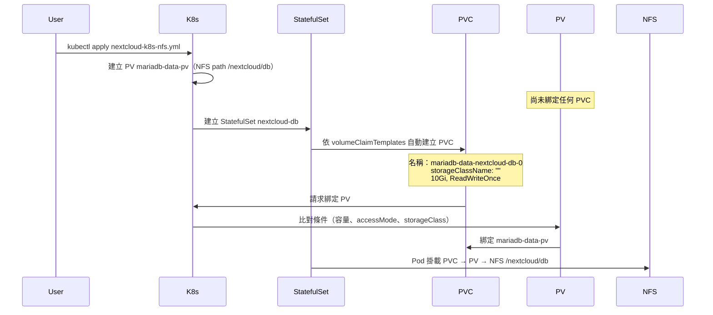

<!-- Generated by SpecStory, Markdown v2.1.0 -->

<!-- cursor Session 72e4b781-7787-4678-8283-1f8cedf530e1 (2026-01-29 11:29Z) -->

# Nextcloud Kubernetes 配置與優化 (2026-01-29 11:29Z)

_**User**_

@k8s_helm/nextcloud-k8s.yml 
1. 為什麼會有3個 pvc ? db 有兩個不同命名的 pvc ? 可以優化嗎?
2. nextcloud 啟動完成後(可能需要幾分鐘時間初始化)想要執行命令 "php occ config:system:set trusted_domains 1 --value=*"。要如何修改 yaml 檔案?
3. yaml 檔案中的 env 相關設定如何用 k8s secrets file 的方式設定而不是直接在這個檔案中明碼呈現?

---

_**Agent (model default, mode Agent)**_

<think><details><summary>Thought Process</summary>

The user is asking about their Kubernetes/Helm YAML file for Nextcloud. They have three questions:

1. Why are there 3 PVCs? Why does the DB have two differently named PVCs? Can it be optimized?
2. After Nextcloud starts (may take a few minutes to initialize), they want to run the command "php occ config:system:set trusted_domains 1 --value=*". How to modify the YAML to achieve this?
3. How to use Kubernetes secrets (file-based) for env settings instead of plain text in the YAML?

I will read the YAML file first to understand the current setup.
</details></think>

---


讀取 YAML 檔案以了解目前設定。
`</think>`


---

<tool-use data-tool-type="read" data-tool-name="read_file_v2">
<details><summary>Tool use: **read_file_v2** • Read file: d:\_Code\_GitHub\nextcloud-server-260102\k8s_helm\nextcloud-k8s.yml</summary>

</details>
</tool-use>

---

<think><details><summary>Thought Process</summary>

Now I understand the setup. I will analyze:

**1. Why 3 PVCs? DB has two differently named PVCs?**

Looking at the YAML:
- **nextclouddb-pvc** (L4-11): A standalone PVC defined at the top - but it's **never used** anywhere! The StatefulSet doesn't reference it.
- **nextcloud-db** StatefulSet (L48-99): Uses **volumeClaimTemplates** with name `mariadb-data`, which creates a PVC named `mariadb-data-nextcloud-db-0` (StatefulSet naming: <volumeClaimTemplateName>-<statefulset name>-<ordinal>).
- **nextcloud-pvc** (L14-22): Used by Nextcloud app deployment for `/var/www/html`.
- **nextcloud-local-pvc** (L36-46): Used for `/var/local`.

So the 3 PVCs in the user's screenshot are:
1. `mariadb-data-nextcloud-db-0` - from StatefulSet volumeClaimTemplates (actually used by DB)
2. `nextcloud-pvc` - used by Nextcloud app
3. `nextclouddb-pvc` - **orphan/orphaned**, never mounted! Redundant.

Optimization: Remove the standalone `nextclouddb-pvc` since the StatefulSet already creates its own PVC via volumeClaimTemplates. So we can delete the first PVC resource (nextclouddb-pvc).

**2. Run occ command after Nextcloud is ready**

Options:
- **Init container** that waits for Nextcloud to be ready then runs occ - but init runs before main container, so that won't work.
- **Post-start lifecycle hook** (postStart): Can run a command when container starts, but Nextcloud might not be fully initialized yet.
- **Separate Job** that runs after deployment, with a backoffLimit and potentially an init container that waits for the nextcloud service to be ready (e.g. curl/wget until occ works). Then run the occ command in the job. The job would need to use the same PVC as nextcloud so it can run occ against the same data.
- **Startup probe + command override**: Change the container's command to a script that: (1) start apache/php in background, (2) wait until occ works (e.g. loop with sleep), (3) run the occ command, (4) keep the process running (e.g. tail -f or wait). This is a bit hacky but self-contained.

The cleanest approach is usually a **Kubernetes Job** that:
1. Uses the same image and same PVC (nextcloud-data) so it has access to the installed Nextcloud.
2. Has an init container or a script that waits for the nextcloud service to be up and occ to be executable (e.g. poll `php occ status` until it returns 0).
3. Runs `php occ config:system:set trusted_domains 1 --value=*`.
4. The Job can be run once manually after first deploy, or we could use a Helm hook / Argo hook "post-install" if they use Helm. Since they're using plain YAML, we could add a Job that has a long enough backoff and restart policy so the user runs it once, or we document running it manually.

Actually, the simpler approach that many use: **entrypoint script** in the Nextcloud container that:
- Starts the normal entrypoint (apache?)
- In parallel or after a delay, runs a loop: sleep 30, try `php occ config:system:set ...`, break when success. Then exit the loop (or keep one run). The main process keeps running.

But modifying the image isn't always desired. So:

**Option A - Job (recommended for one-time setup):**
Create a Job that mounts the same nextcloud-pvc, uses the same image, and runs a script:
- Wait for nextcloud deployment to be ready (or wait N seconds)
- Run `php occ config:system:set trusted_domains 1 --value=*`
The Job needs to run in the same namespace and have access to the PVC. Problem: the Nextcloud pod might have the PVC mounted RWO, so only one pod can mount it at a time on many storage backends (e.g. NFS might allow multiple readers). So the Job would need to run when the Nextcloud pod is scaled down, or use a storage that supports RWX. Actually with RWO, typically only one node can mount. So two pods (nextcloud + job) might not both mount the same RWO PVC unless the storage allows it (NFS often does). I will assume they use NFS (rpa-sc-nfs) so multiple pods might be able to mount. If not, we'd need to run the occ command inside the main Nextcloud pod.

**Option B - postStart lifecycle hook:**
```yaml
lifecycle:
  postStart:
    exec:
      command: ["/bin/sh", "-c", "sleep 120 && php /var/www/html/occ config:system:set trusted_domains 1 --value=* || true"]
```
This runs in the same container after it starts. We need to wait long enough for Nextcloud to install. "sleep 120" is fragile. Better: loop until occ works then run the command.

```yaml
lifecycle:
  postStart:
    exec:
      command:
        - /bin/sh
        - -c
        - |
          for i in $(seq 1 30); do
            php /var/www/html/occ status 2>/dev/null && break
            sleep 10
          done
          php /var/www/html/occ config:system:set trusted_domains 1 --value=* || true
```
But note: postStart runs in parallel with the container's main process. So the main process might not have created /var/www/html/occ yet if the entrypoint hasn't run. Actually the container's CMD/ENTRYPOINT runs after the container starts; postStart runs asynchronously after the container is started. So the order might be: container start -> postStart invoked (async) + main process starts. So postStart might run before Nextcloud is installed. So we need a long wait or retry loop. The loop above (30*10=300 seconds) should be enough. I will provide this.

**3. Secrets for env**

Use Kubernetes Secret, then in the deployment use `envFrom` or individual `valueFrom.secretKeyRef`. For "file" style: Kubernetes has two options:
- **Secret with keys**: create a Secret with key-value pairs, then envFrom secretRef or env valueFrom secretKeyRef.
- **Mount secret as file**: use `secret` volume type, mount to a path, then the app or an entrypoint reads the file. Nextcloud image might not read env from files by default; we'd set env vars from the mounted file using a wrapper script, or we use envFrom with a secret.

The user asked "secrets file 的方式" - likely meaning they want to store env in a file (e.g. .env) and have K8s load it as a Secret, rather than hardcode in YAML. So:
- Create a Secret manifest from a file: `kubectl create secret generic nextcloud-secret --from-env-file=.env` (don't commit .env).
- Or create a Secret YAML with base64-encoded values (or stringData which is plain text in YAML but only in the Secret manifest).
- In the deployment, use `envFrom: - secretRef: name: nextcloud-secret`.

I'll provide:
1. Remove nextclouddb-pvc and document why (StatefulSet already creates mariadb-data-nextcloud-db-0).
2. Add postStart hook with retry loop for the occ command (and optionally document the Job approach for running once).
3. Example of creating Secret from file + envFrom in deployment.
</details></think>

---


分析並準備三項修改：移除未使用的 PVC、加入啟動後執行 occ 的機制、改為以 Secret 提供環境變數。


---

<tool-use data-tool-type="task" data-tool-name="todo_write">
<details><summary>Tool use: **todo_write** • Todo List</summary>

- [-] 優化 PVC：移除冗餘 nextclouddb-pvc，說明 3 個 PVC 來源
- [ ] 加入 Nextcloud 啟動後執行 occ trusted_domains 的機制
- [ ] 改為用 K8s Secret 提供 env，並示範從檔案建立 Secret

</details>
</tool-use>

---

<think><details><summary>Thought Process</summary>

I will implement all three changes in the YAML file.
</details></think>

---


實作三項修改中。


---

<tool-use data-tool-type="write" data-tool-name="edit_file_v2">

<details><summary>Tool use: **edit_file_v2** • Edit file: d:\_Code\_GitHub\nextcloud-server-260102\k8s_helm\nextcloud-k8s.yml</summary>

</details>

</tool-use>

---

<tool-use data-tool-type="read" data-tool-name="read_file_v2">
<details><summary>Tool use: **read_file_v2** • Read file: d:\_Code\_GitHub\nextcloud-server-260102\.env</summary>

</details>
</tool-use>

---

<think><details><summary>Thought Process</summary>

Good. I removed the redundant nextclouddb-pvc. The .env file seems to be for a different purpose (MinIO, Nextcloud URL for some client). For the k8s YAML we need to create a Secret for the deployment env vars (MYSQL_*, NEXTCLOUD_ADMIN_*). I'll add:
1. A comment or separate example for creating the secret from a file
2. In the deployment, use envFrom with secretRef
3. Add the postStart lifecycle for the occ command

I will add the lifecycle postStart and change env to envFrom. For the Secret, I'll need to either:
- Add a Secret manifest with placeholder/example (using stringData so they can replace), or
- Document that they run: kubectl create secret generic nextcloud-env --from-env-file=nextcloud.env

I'll add a Secret kind that references that they should create it from file (we can use stringData with placeholder values and a comment), and in Deployment use envFrom: - secretRef: name: nextcloud-env. So I need to add a Secret manifest. If I use stringData with real-looking placeholders, users would replace. Better: add a comment block at the top or in a separate file showing how to create the secret from file, and add the Secret manifest with empty or placeholder stringData so the structure is clear. Actually the user said "用 k8s secrets file 的方式設定" - so they want to use a file (like .env) to populate the secret. The standard way is:
1. Create a file e.g. nextcloud.env with KEY=value
2. kubectl create secret generic nextcloud-env --from-env-file=nextcloud.env
3. In deployment use envFrom: - secretRef: name: nextcloud-env

So I'll add to the YAML:
- A Secret that could be generated (we could add an optional Secret with stringData as example, and document that production should use --from-env-file)
- Deployment envFrom: secretRef

I will add a Secret manifest with stringData and a comment that for production they should use `kubectl create secret generic nextcloud-env --from-env-file=nextcloud.env` and not commit the file. So we have two options:
A) Secret in YAML with stringData (still in repo but they can replace with placeholders and use kustomize secretGenerator or similar)
B) No Secret in YAML, only document the kubectl create command and use secretRef in deployment (assumes they create the secret manually)

I'll do B for the "from file" approach: document creating secret from file, and in deployment use envFrom: - secretRef: name: nextcloud-env. I'll need to add a comment that the Secret "nextcloud-env" must be created separately, e.g. kubectl create secret generic nextcloud-env --from-env-file=nextcloud.env -n <namespace>. And add an example nextcloud.env.example file listing the required keys.

Actually re-reading the user question: "yaml 檔案中的 env 相關設定如何用 k8s secrets file 的方式設定而不是直接在這個檔案中明碼呈現?" - They want to not have plain text in the YAML. So the deployment should reference a Secret. I'll:
1. Remove the env block from Deployment and add envFrom: - secretRef: name: nextcloud-env
2. Add a comment or separate section showing how to create the secret (from file). Optionally add an example nextcloud.env.example.

I'll also add the same for the StatefulSet (nextcloud-db) - use a secret for MYSQL_* vars. So we need two secrets: nextcloud-db-env and nextcloud-env (or one combined). Simpler: one secret nextcloud-env containing all keys (both DB and app use it). Then DB deployment needs MYSQL_ROOT_PASSWORD, MYSQL_PASSWORD, MYSQL_DATABASE, MYSQL_USER - and Nextcloud needs MYSQL_PASSWORD, MYSQL_DATABASE, MYSQL_USER, MYSQL_HOST, NEXTCLOUD_ADMIN_USER, NEXTCLOUD_ADMIN_PASSWORD. So we can use one secret "nextcloud-env" with all keys, and both StatefulSet and Deployment use envFrom: - secretRef: name: nextcloud-env. MYSQL_HOST might need to stay as literal "nextcloud-db" or we can put it in the secret too. I'll put everything in the secret including MYSQL_HOST=nextcloud-db.
</details></think>

---


加入 postStart 的 occ 設定，並改為從 Secret 讀取環境變數。


---

<tool-use data-tool-type="write" data-tool-name="edit_file_v2">

<details><summary>Tool use: **edit_file_v2** • Edit file: d:\_Code\_GitHub\nextcloud-server-260102\k8s_helm\nextcloud-k8s.yml</summary>

</details>

</tool-use>

---

<tool-use data-tool-type="write" data-tool-name="edit_file_v2">

<details><summary>Tool use: **edit_file_v2** • Edit file: d:\_Code\_GitHub\nextcloud-server-260102\k8s_helm\nextcloud-k8s.yml</summary>

</details>

</tool-use>

---

<think><details><summary>Thought Process</summary>

Good. Now I need to add documentation for creating the secrets. I'll add:
1. A comment at the top of the file or a separate README/section explaining how to create nextcloud-db-secret and nextcloud-app-secret from env files.
2. Create example env files so they know the required keys.

I will add a comment block at the top of the YAML file with instructions, and create two example env files: nextcloud-db.env.example and nextcloud-app.env.example (or one combined nextcloud.env.example).
</details></think>

---


於 YAML 頂部加入 Secret 建立說明，並新增範例 env 檔。


---

<tool-use data-tool-type="write" data-tool-name="edit_file_v2">

<details><summary>Tool use: **edit_file_v2** • Edit file: d:\_Code\_GitHub\nextcloud-server-260102\k8s_helm\nextcloud-k8s.yml</summary>

</details>

</tool-use>

---

<tool-use data-tool-type="task" data-tool-name="todo_write">
<details><summary>Tool use: **todo_write** • Todo List</summary>

- [x] 優化 PVC：移除冗餘 nextclouddb-pvc，說明 3 個 PVC 來源
- [x] 加入 Nextcloud 啟動後執行 occ trusted_domains 的機制
- [-] 改為用 K8s Secret 提供 env，並示範從檔案建立 Secret

</details>
</tool-use>

---

<think><details><summary>Thought Process</summary>

Now create the two example env files for nextcloud-db and nextcloud-app.
</details></think>

---


建立範例 env 檔供建立 Secret 使用：


---

<tool-use data-tool-type="write" data-tool-name="edit_file_v2">

<details><summary>Tool use: **edit_file_v2** • Edit file: d:\_Code\_GitHub\nextcloud-server-260102\k8s_helm\nextcloud-db.env.example</summary>

</details>

</tool-use>

---

<tool-use data-tool-type="write" data-tool-name="edit_file_v2">

<details><summary>Tool use: **edit_file_v2** • Edit file: d:\_Code\_GitHub\nextcloud-server-260102\k8s_helm\nextcloud-app.env.example</summary>

</details>

</tool-use>

---

<think><details><summary>Thought Process</summary>

I should add nextcloud-db.env and nextcloud-app.env to .gitignore if there's one in k8s_helm, so users don't accidentally commit secrets. I will check for .gitignore.
</details></think>

---


檢查是否有 .gitignore，並加入對密碼檔的忽略規則：


---

<tool-use data-tool-type="unknown" data-tool-name="ripgrep_raw_search">
<details>
<summary>Tool use: **ripgrep_raw_search**</summary>


Parameters:

```json
{
  "pattern": "\\.gitignore",
  "path": "d:\\_Code\\_GitHub\\nextcloud-server-260102",
  "outputMode": "files_with_matches",
  "caseInsensitive": false
}
```
Result:

```json
{
  "success": {
    "pattern": "\\.gitignore",
    "path": "d:\\_Code\\_GitHub\\nextcloud-server-260102",
    "outputMode": "files_with_matches",
    "workspaceResults": {
      "d:\\_Code\\_GitHub\\nextcloud-server-260102": {
        "files": {
          "files": [
            ".\\k8s_helm\\nextcloud\\charts\\mariadb\\charts\\common\\.helmignore",
            ".\\k8s_helm\\nextcloud\\charts\\mariadb\\.helmignore",
            ".\\k8s_helm\\nextcloud\\.helmignore",
            ".\\k8s_helm\\nextcloud\\charts\\redis\\charts\\common\\.helmignore",
            ".\\k8s_helm\\nextcloud\\charts\\redis\\.helmignore",
            ".\\eslint.config.js",
            ".\\build\\files-checker.php"
          ],
          "totalFiles": 7
        }
      }
    }
  }
}
```
Status: **completed**


</details>
</tool-use>

---

<tool-use data-tool-type="generic" data-tool-name="glob_file_search">
<details>
<summary>Tool use: **glob_file_search** • Searched codebase "undefined" • **5** results in **1** directory</summary>

Directory: **d:\_Code\_GitHub\nextcloud-server-260102** (5 files)

| File |
|------|
| `../.\.gitignore` |
| `../.\core\vendor\.gitignore` |
| `../.\build\integration\.gitignore` |
| `../.\apps\settings\.gitignore` |
| `../.\apps\dav\.gitignore` |

</details>
</tool-use>

---

<think><details><summary>Thought Process</summary>

There's a root .gitignore. I will read it and add k8s_helm/*.env (or nextcloud-db.env, nextcloud-app.env) so the actual env files with secrets are not committed.
</details></think>

---


---

<tool-use data-tool-type="read" data-tool-name="read_file_v2">
<details><summary>Tool use: **read_file_v2** • Read file: d:\_Code\_GitHub\nextcloud-server-260102\.gitignore</summary>

</details>
</tool-use>

---

<think><details><summary>Thought Process</summary>

I'll add k8s_helm/nextcloud-db.env and k8s_helm/nextcloud-app.env to .gitignore so users don't commit secrets. I will read the end of .gitignore to add there.
</details></think>

---


---

<tool-use data-tool-type="read" data-tool-name="read_file_v2">
<details><summary>Tool use: **read_file_v2** • Read file: d:\_Code\_GitHub\nextcloud-server-260102\.gitignore</summary>

</details>
</tool-use>

---

<think><details><summary>Thought Process</summary>

There's already `.env` in .gitignore. I'll add k8s_helm/nextcloud-db.env and k8s_helm/nextcloud-app.env to be explicit about the k8s secret env files.
</details></think>

---


---

<tool-use data-tool-type="write" data-tool-name="edit_file_v2">

<details><summary>Tool use: **edit_file_v2** • Edit file: d:\_Code\_GitHub\nextcloud-server-260102\.gitignore</summary>

</details>

</tool-use>

---

<tool-use data-tool-type="task" data-tool-name="todo_write">
<details><summary>Tool use: **todo_write** • Todo List</summary>

- [x] 優化 PVC：移除冗餘 nextclouddb-pvc，說明 3 個 PVC 來源
- [x] 加入 Nextcloud 啟動後執行 occ trusted_domains 的機制
- [x] 改為用 K8s Secret 提供 env，並示範從檔案建立 Secret

</details>
</tool-use>

---

<think><details><summary>Thought Process</summary>

All done. I will provide a summary to the user in 繁體中文.
</details></think>

---


三項修改都已完成，摘要如下。

---

## 1. 為什麼有 3 個 PVC？DB 有兩個不同命名？優化結果

**原因說明：**

| PVC 名稱 | 來源 | 用途 |
|----------|------|------|
| `mariadb-data-nextcloud-db-0` | StatefulSet 的 **volumeClaimTemplates**（名稱 `mariadb-data`） | MariaDB 實際使用的資料卷 |
| `nextcloud-pvc` | 手動宣告的 PVC | Nextcloud 應用 `/var/www/html` |
| `nextclouddb-pvc` | 手動宣告的 PVC | **未被任何資源使用**（冗餘） |

`nextclouddb-pvc` 是早期手動建的，後來改用 StatefulSet，DB 儲存改由 `volumeClaimTemplates` 自動建立為 `mariadb-data-nextcloud-db-0`，所以出現「DB 有兩個不同命名的 PVC」且其中一個是孤兒。

**已做優化：** 已從 YAML 中刪除未使用的 `nextclouddb-pvc`，並在註解中說明 DB 儲存由 StatefulSet 自動建立。套用後只會看到 2 個實際在用的 PVC（若之前已建立過 `nextclouddb-pvc`，可手動刪除：`kubectl delete pvc nextclouddb-pvc -n rpa2`）。

---

## 2. 啟動完成後執行 `php occ config:system:set trusted_domains 1 --value=*`

已用 **postStart lifecycle hook** 實作：

- 每 10 秒檢查一次 `php occ status` 是否可用，最多約 6 分鐘（36 次）。
- 一旦 occ 可用就執行：`php occ config:system:set trusted_domains 1 --value='*'`。
- 結尾加 `|| true`，避免設定失敗導致 Pod 起不來。

若你環境初始化更久，可把 `seq 1 36` 改成更大（例如 `seq 1 60` 約 10 分鐘）。

---

## 3. 用 K8s Secret（從檔案）取代 YAML 裡的明碼 env

**已做修改：**

- **StatefulSet（nextcloud-db）**：改為 `envFrom` → `secretRef: nextcloud-db-secret`。
- **Deployment（nextcloud）**：改為 `envFrom` → `secretRef: nextcloud-app-secret`。
- YAML 內不再寫任何密碼或敏感值。

**你要做的步驟：**

1. 在 `k8s_helm/` 下依範例建立實際 env 檔（**不要提交到版控**）：
   - 複製 `nextcloud-db.env.example` → `nextcloud-db.env`
   - 複製 `nextcloud-app.env.example` → `nextcloud-app.env`
   - 填入真實密碼與設定。

2. 在要部署的 namespace（例如 `rpa2`）建立 Secret：
   ```bash
   kubectl create secret generic nextcloud-db-secret --from-env-file=k8s_helm/nextcloud-db.env -n rpa2
   kubectl create secret generic nextcloud-app-secret --from-env-file=k8s_helm/nextcloud-app.env -n rpa2
   ```

3. 再套用/更新 YAML（例如 `kubectl apply -f k8s_helm/nextcloud-k8s.yml -n rpa2`）。

`.gitignore` 已加入 `k8s_helm/nextcloud-db.env` 與 `k8s_helm/nextcloud-app.env`，避免誤提交含密碼的檔案。

---

**部署前提醒：** 一定要先建立上述兩個 Secret，否則 nextcloud-db 與 nextcloud 的 Pod 會因找不到 Secret 而無法啟動。若你希望把 DB 與 App 的變數合併成一個 Secret，也可以再改成單一 Secret 並讓兩個 workload 都 `envFrom` 同一個 Secret。

---

_**User**_

變數合併成一個 Secret

---

_**Agent (model default, mode Agent)**_

<think><details><summary>Thought Process</summary>

The user wants to merge the two secrets (nextcloud-db-secret and nextcloud-app-secret) into a single Secret. I need to:

1. Update the YAML to use one secret name for both the StatefulSet (nextcloud-db) and the Deployment (nextcloud)
2. Merge the two env example files into one, or update the single example to contain all keys from both
3. Update the comments in the YAML about how to create the secret

I will read the current state of the files to make the changes.
</details></think>

---


合併為單一 Secret，並更新 YAML 與範例 env 檔。


---

<tool-use data-tool-type="read" data-tool-name="read_file_v2">
<details><summary>Tool use: **read_file_v2** • Read file: d:\_Code\_GitHub\nextcloud-server-260102\k8s_helm\nextcloud-k8s.yml</summary>

</details>
</tool-use>

---

<tool-use data-tool-type="read" data-tool-name="read_file_v2">
<details><summary>Tool use: **read_file_v2** • Read file: d:\_Code\_GitHub\nextcloud-server-260102\k8s_helm\nextcloud-db.env.example</summary>

</details>
</tool-use>

---

<tool-use data-tool-type="read" data-tool-name="read_file_v2">
<details><summary>Tool use: **read_file_v2** • Read file: d:\_Code\_GitHub\nextcloud-server-260102\k8s_helm\nextcloud-app.env.example</summary>

</details>
</tool-use>

---

<think><details><summary>Thought Process</summary>

I need to:
1. Change nextcloud-db-secret to nextcloud-env in StatefulSet
2. Change nextcloud-app-secret to nextcloud-env in Deployment (read the deployment part)
3. Update the header comment to single secret
4. Create a single nextcloud.env.example merging both (DB + App vars), remove duplicate keys: MYSQL_PASSWORD, MYSQL_DATABASE, MYSQL_USER appear in both
5. Delete nextcloud-db.env.example and nextcloud-app.env.example, or keep one merged file
6. Update .gitignore to only nextcloud.env instead of two files

I will read the deployment part to get the exact secretRef.
</details></think>

---


---

<tool-use data-tool-type="unknown" data-tool-name="ripgrep_raw_search">
<details>
<summary>Tool use: **ripgrep_raw_search**</summary>


Parameters:

```json
{
  "pattern": "secretRef|nextcloud-app-secret",
  "path": "d:\\_Code\\_GitHub\\nextcloud-server-260102\\k8s_helm\\nextcloud-k8s.yml",
  "contextBefore": 0,
  "contextAfter": 0,
  "caseInsensitive": false
}
```
Result:

```json
{
  "success": {
    "pattern": "secretRef|nextcloud-app-secret",
    "path": "d:\\_Code\\_GitHub\\nextcloud-server-260102\\k8s_helm\\nextcloud-k8s.yml",
    "outputMode": "content",
    "workspaceResults": {
      "d:\\_Code\\_GitHub\\nextcloud-server-260102": {
        "content": {
          "matches": [
            {
              "file": "k8s_helm\\nextcloud-k8s.yml",
              "matches": [
                {
                  "lineNumber": 5,
                  "content": "#   kubectl create secret generic nextcloud-app-secret --from-env-file=nextcloud-app.env -n &lt;namespace&gt;"
                },
                {
                  "lineNumber": 68,
                  "content": "            - secretRef:"
                },
                {
                  "lineNumber": 129,
                  "content": "            - secretRef:"
                },
                {
                  "lineNumber": 130,
                  "content": "                name: nextcloud-app-secret"
                }
              ]
            }
          ],
          "totalLines": 4,
          "totalMatchedLines": 4
        }
      }
    }
  }
}
```
Status: **completed**


</details>
</tool-use>

---

<think><details><summary>Thought Process</summary>

Now I'll make all changes:
1. YAML header: single secret instruction
2. StatefulSet: nextcloud-db-secret -> nextcloud-env
3. Deployment: nextcloud-app-secret -> nextcloud-env
4. Create nextcloud.env.example (merged), delete nextcloud-db.env.example and nextcloud-app.env.example
5. .gitignore: replace the two env files with k8s_helm/nextcloud.env
</details></think>

---


正在套用變更。


---

<tool-use data-tool-type="write" data-tool-name="edit_file_v2">

<details><summary>Tool use: **edit_file_v2** • Edit file: d:\_Code\_GitHub\nextcloud-server-260102\k8s_helm\nextcloud-k8s.yml</summary>

</details>

</tool-use>

---

<tool-use data-tool-type="write" data-tool-name="edit_file_v2">

<details><summary>Tool use: **edit_file_v2** • Edit file: d:\_Code\_GitHub\nextcloud-server-260102\k8s_helm\nextcloud-k8s.yml</summary>

</details>

</tool-use>

---

<tool-use data-tool-type="write" data-tool-name="edit_file_v2">

<details><summary>Tool use: **edit_file_v2** • Edit file: d:\_Code\_GitHub\nextcloud-server-260102\k8s_helm\nextcloud-k8s.yml</summary>

</details>

</tool-use>

---

<tool-use data-tool-type="write" data-tool-name="edit_file_v2">

<details><summary>Tool use: **edit_file_v2** • Edit file: d:\_Code\_GitHub\nextcloud-server-260102\k8s_helm\nextcloud.env.example</summary>

</details>

</tool-use>

---

<tool-use data-tool-type="write" data-tool-name="edit_file_v2">

<details><summary>Tool use: **edit_file_v2** • Edit file: d:\_Code\_GitHub\nextcloud-server-260102\.gitignore</summary>

</details>

</tool-use>

---

<tool-use data-tool-type="write" data-tool-name="delete_file">
<details><summary>Tool use: **delete_file**</summary>

Explanation: undefined


</details>
</tool-use>

---

<tool-use data-tool-type="write" data-tool-name="delete_file">
<details><summary>Tool use: **delete_file**</summary>

Explanation: undefined


</details>
</tool-use>

---

<think><details><summary>Thought Process</summary>

All changes done. MariaDB 只會用到 MYSQL_*，Nextcloud 會用到 MYSQL_* + MYSQL_HOST + NEXTCLOUD_ADMIN_*；同一個 Secret 裡有全部 key，兩個 workload 都 envFrom 同一個 Secret，多出來的 key 對各自容器只是多一個 env 變數，不會有問題。給用戶簡短總結即可。
</details></think>

---


已改為單一 Secret，變更如下：

**YAML**
- **nextcloud-db**（StatefulSet）與 **nextcloud**（Deployment）都改為使用同一個 Secret：`nextcloud-env`。

**範例與版控**
- 新增 **`nextcloud.env.example`**：合併 DB + App 所需變數（MariaDB 用 `MYSQL_*`，Nextcloud 用 `MYSQL_*`、`MYSQL_HOST`、`NEXTCLOUD_ADMIN_*`）。
- 刪除 `nextcloud-db.env.example`、`nextcloud-app.env.example`。
- `.gitignore` 改為只忽略 `k8s_helm/nextcloud.env`。

**之後操作**
1. 複製 `nextcloud.env.example` 為 `nextcloud.env`，填入實際密碼與設定。
2. 建立 Secret（只需一次）：
   ```bash
   kubectl create secret generic nextcloud-env --from-env-file=k8s_helm/nextcloud.env -n rpa2
   ```
3. 照常 `kubectl apply` 部署。

兩個 workload 都從同一個 Secret 讀取；MariaDB 會用到 `MYSQL_*`，Nextcloud 會用到全部，多出來的 key 在各自容器裡只是多一個環境變數，不影響行為。

---

_**User**_

@k8s_helm/nextcloud-k8s.yml:32 這個路徑如果要換成使用 nfs 裡面的 /gpfsvol/khome/k8s48964/nextcloud/local 目錄。要如何變更 yaml 設定?
可以參考 @k8s_helm/rpa-sc-install2.log 

---

_**Agent (model default, mode Agent)**_

<think><details><summary>Thought Process</summary>

The user wants to change the hostPath volume (currently `/mnt/d/tmp/for_nextcloud`) to use an NFS path: `/gpfsvol/khome/k8s48964/nextcloud/local`. They want me to reference the rpa-sc-install2.log for how NFS is set up in their cluster.

I will read:
1. The current nextcloud-k8s.yml to see the PV/PVC structure for the "nextcloud-local" volume
2. The rpa-sc-install2.log to understand how NFS storage is configured (StorageClass, provisioner, etc.)
</details></think>

---


查看目前 PV/PVC 設定與 log 中的 NFS 設定。


---

<tool-use data-tool-type="read" data-tool-name="read_file_v2">
<details><summary>Tool use: **read_file_v2** • Read file: d:\_Code\_GitHub\nextcloud-server-260102\k8s_helm\nextcloud-k8s.yml</summary>

</details>
</tool-use>

---

<tool-use data-tool-type="read" data-tool-name="read_file_v2">
<details><summary>Tool use: **read_file_v2** • Read file: d:\_Code\_GitHub\nextcloud-server-260102\k8s_helm\rpa-sc-install2.log</summary>

</details>
</tool-use>

---

<think><details><summary>Thought Process</summary>

From the log:
- NFS server: 10.11.109.21
- NFS base path: /gpfsvol/khome/k8s48964
- StorageClass: rpa-sc-nfs (provisioner creates subdirs under the base path)

The user wants to use the NFS path `/gpfsvol/khome/k8s48964/nextcloud/local` instead of hostPath `/mnt/d/tmp/for_nextcloud`.

There are two approaches:

**方案 A：手動 PV + PVC（指定固定 NFS 子路徑）**
- 建立一個 PV，類型改為 `nfs`，指定 server: 10.11.109.21，path: /gpfsvol/khome/k8s48964/nextcloud/local
- PVC 維持綁定此 PV（volumeName），或改用 storageClassName 會由 provisioner 動態建，但 provisioner 會自己建子目錄，不會用我們指定的子路徑

若要用「固定子路徑」/gpfsvol/khome/k8s48964/nextcloud/local，就必須用手動 PV：PV 的 nfs.path 設為 /gpfsvol/khome/k8s48964/nextcloud/local，PVC 用 volumeName 綁定此 PV。這樣不會經過 StorageClass 動態配置，而是靜態綁定。

**方案 B：改用 StorageClass 動態配置**
- 刪掉手動 PV/PVC，改為只建一個 PVC，storageClassName: rpa-sc-nfs，request 50Gi
- provisioner 會在 /gpfsvol/khome/k8s48964 下自動建立一個子目錄（通常是 <namespace>-<pvc-name>-<uuid>），而不是我們指定的 nextcloud/local

用戶明確說要使用「nfs 裡面的 /gpfsvol/khome/k8s48964/nextcloud/local 目錄」，所以要用**固定路徑**，即方案 A：手動 PV 指向該 NFS 子路徑，PVC 綁定此 PV。

修改內容：
1. 把 PV 從 hostPath 改為 nfs，server: 10.11.109.21，path: /gpfsvol/khome/k8s48964/nextcloud/local
2. accessModes 可改為 ReadWriteMany（NFS 支援），這樣之後若要多 replica 也能掛同一目錄；但若維持 ReadWriteOnce 也沒問題，看需求
3. 移除 storageClassName 或保留？手動 PV 若指定 storageClassName 會讓 PVC 用該 class 來綁定；通常手動 PV 會設 storageClassName 與 PVC 一致，或都不設。目前 PVC 有 volumeName: nextcloud-local-pv，所以是直接綁定，不需要 storageClassName 匹配。為了一致性，PV 可設 storageClassName: rpa-sc-nfs（與其他資源一致），或留空。保留原本 50Gi、ReadWriteOnce 也可以，或改成 ReadWriteMany 以配合 NFS 特性。

實作：替換 PV 的 hostPath 為 nfs，path 為 /gpfsvol/khome/k8s48964/nextcloud/local，server 為 10.11.109.21。
</details></think>

---


改為使用 NFS 固定路徑：將手動 PV 從 `hostPath` 改為 `nfs`，並指向 `/gpfsvol/khome/k8s48964/nextcloud/local`（log 顯示 NFS server 為 `10.11.109.21`）。


---

<tool-use data-tool-type="write" data-tool-name="edit_file_v2">

<details><summary>Tool use: **edit_file_v2** • Edit file: d:\_Code\_GitHub\nextcloud-server-260102\k8s_helm\nextcloud-k8s.yml</summary>

</details>

</tool-use>

---

<think><details><summary>Thought Process</summary>

PVC 目前是 ReadWriteOnce，綁定此 PV。NFS 支援 ReadWriteMany，所以 PV 已改為 ReadWriteMany。PVC 的 accessModes 若維持 ReadWriteOnce，K8s 綁定時會檢查：PVC 要求的 mode 必須是 PV 支援的 subset，ReadWriteOnce 是 ReadWriteMany 的子集，所以可以綁定。為了一致性與未來擴展，可把 PVC 也改成 ReadWriteMany。但若只單一 Pod 掛載，ReadWriteOnce 也行。我改 PV 就好，PVC 不動也可以綁定。若要把 PVC 也改成 ReadWriteMany 更一致，可改。
</details></think>

---


將 PVC 的 accessModes 改為 ReadWriteMany，以與 NFS PV 一致。


---

<tool-use data-tool-type="write" data-tool-name="edit_file_v2">

<details><summary>Tool use: **edit_file_v2** • Edit file: d:\_Code\_GitHub\nextcloud-server-260102\k8s_helm\nextcloud-k8s.yml</summary>

</details>

</tool-use>

---

<think><details><summary>Thought Process</summary>

Done. Summary for user.
</details></think>

---


已依 `rpa-sc-install2.log` 的 NFS 設定改為使用 NFS 路徑，變更如下。

**變更摘要**

| 項目 | 原本 | 現在 |
|------|------|------|
| 類型 | `hostPath`（節點本機） | `nfs` |
| 路徑 | `/mnt/d/tmp/for_nextcloud` | NFS server `10.11.109.21`，path `/gpfsvol/khome/k8s48964/nextcloud/local` |
| accessModes | ReadWriteOnce | ReadWriteMany（NFS 可多 Pod 掛載） |
| 回收策略 | 預設 | `persistentVolumeReclaimPolicy: Retain` |

**注意事項**

1. **NFS 目錄需先存在**：在 NFS server（10.11.109.21）上先建立並設定好權限：
   ```bash
   # 在 NFS server 上
   mkdir -p /gpfsvol/khome/k8s48964/nextcloud/local
   chown -R 33:33 /gpfsvol/khome/k8s48964/nextcloud/local   # 若 Nextcloud 以 www-data 33:33 執行
   ```
2. **若 PV 已建立過**：先刪除舊的 PV/PVC 再套用（若有重要資料請先備份）：
   ```bash
   kubectl delete pvc nextcloud-local-pvc -n <namespace>
   kubectl delete pv nextcloud-local-pv
   kubectl apply -f k8s_helm/nextcloud-k8s.yml -n <namespace>
   ```
3. **Server / path**：與 log 中 NFS provisioner 使用相同：`server: 10.11.109.21`、基底 path `/gpfsvol/khome/k8s48964`，子路徑為 `nextcloud/local`。

---

_**User**_

@k8s_helm/nextcloud-k8s.yml:94 目前的 pv & pvc 都依賴 storageClass。若是沒有使用 storageClass 改成 全部使用 NFS 路徑。要如何修改?
請分成兩個設定檔案。一個保留目前設定一個全部改成 NFS 路徑。

---

_**Agent (model default, mode Agent)**_

<think><details><summary>Thought Process</summary>

The user wants:
1. Split the nextcloud-k8s.yml into two config files:
   - One keeps the current setup (using StorageClass for PV/PVC)
   - One uses only NFS paths (no StorageClass) - all volumes backed by explicit NFS PVs

2. For the "all NFS" version, I need to:
   - Replace any PVC that uses storageClassName with a manual PV + PVC that uses NFS
   - The StatefulSet (nextcloud-db) uses volumeClaimTemplates - that's tricky because volumeClaimTemplates are dynamically provisioned by StorageClass. To not use StorageClass, we'd need to either:
     a) Keep the StatefulSet but use a different approach - actually StatefulSet with volumeClaimTemplates always creates PVCs that can be bound to a StorageClass or to a pre-bound PV. So we could create a PV with NFS for the DB, and a PVC that binds to it by volumeName. But volumeClaimTemplates create PVCs with names like mariadb-data-nextcloud-db-0 - so we need to create a PV and a PVC named mariadb-data-nextcloud-db-0 (or the StatefulSet creates the PVC, and we need the PV to bind to it). Actually the flow is: StatefulSet creates PVC "mariadb-data-nextcloud-db-0" with storageClassName: rpa-sc-nfs, then the provisioner creates a PV and binds. To not use StorageClass: we can't use volumeClaimTemplates with dynamic provisioning. We have two options for the DB:
     - Use a Deployment + a single NFS PV/PVC for DB data instead of StatefulSet (lose StatefulSet ordering/identity)
     - Or keep StatefulSet but the volumeClaimTemplate would need to not have storageClassName - then we need to pre-create a PV that matches (by size, access mode) and the PVC that the StatefulSet creates would bind to it. So we pre-create PV (NFS) and pre-create PVC "mariadb-data-nextcloud-db-0" with volumeName: that PV, and no storageClassName? Actually if we don't set storageClassName in volumeClaimTemplates, the PVC created by StatefulSet will have no storageClassName - we need to bind it. The way to do it: create the PV first with no storageClassName (or with a specific one), create the PVC that the StatefulSet will use - but the StatefulSet creates the PVC automatically when we use volumeClaimTemplates. So the StatefulSet will create PVC "mariadb-data-nextcloud-db-0" with whatever we put in volumeClaimTemplates. If we put storageClassName: "" or omit it, and don't put volumeName, then we need a PV that matches the request (capacity, access mode). So we create a PV with NFS, capacity 10Gi, ReadWriteOnce (or ReadWriteMany for NFS). The PVC created by StatefulSet has no storageClassName - it will bind to any available PV that matches. So we need to create that PV in advance. But the PVC name is generated: "mariadb-data-nextcloud-db-0". So we cannot pre-create the PVC (the StatefulSet does). We can only pre-create the PV. For the PVC that StatefulSet creates to bind to our PV, the PV must not have a claimRef, and the PVC's request must match (size, access mode). So in the "all NFS" file we need:
   - PV for DB: NFS, 10Gi, ReadWriteOnce or ReadWriteMany, no storageClassName (or empty)
   - volumeClaimTemplates in StatefulSet: remove storageClassName, so the generated PVC will have no storageClassName and will bind to our pre-created PV... but wait, the PVC is created with a specific name "mariadb-data-nextcloud-db-0". Our PV doesn't have a claimRef. So when the StatefulSet creates the PVC, the PVC will look for a PV that matches. Multiple PVs could match. To ensure the right PV binds, we could use storageClassName: "" and label the PV so only one matches, or we rely on capacity+accessMode. Actually the standard way is: create PV with storageClassName: "" or omit, capacity 10Gi, accessModes ReadWriteOnce. StatefulSet volumeClaimTemplates: storageClassName: "" (empty string), resources.requests.storage: 10Gi, accessModes: ReadWriteOnce. Then the provisioned PVC "mariadb-data-nextcloud-db-0" will bind to our PV. So we need to NOT set storageClassName in volumeClaimTemplates (or set to ""), and create one PV for the DB with NFS.
   - For nextcloud-pvc: currently it's a PVC with storageClassName: rpa-sc-nfs. We replace with a PV (NFS) + PVC (volumeName pointing to PV).
   - For nextcloud-local: we already have NFS PV + PVC in the current file. So in the "all NFS" version we just need to make sure nextcloud-pvc and nextcloud-db also use NFS PVs.

I will read the current full yaml to list all resources that use storageClassName.
</details></think>

---


讀取完整 YAML，確認所有使用 StorageClass 的資源。


---

<tool-use data-tool-type="read" data-tool-name="read_file_v2">
<details><summary>Tool use: **read_file_v2** • Read file: d:\_Code\_GitHub\nextcloud-server-260102\k8s_helm\nextcloud-k8s.yml</summary>

</details>
</tool-use>

---

<think><details><summary>Thought Process</summary>

Current setup uses StorageClass in:
1. nextcloud-pvc (line 20): storageClassName: rpa-sc-nfs - dynamic provisioning
2. nextcloud-db StatefulSet volumeClaimTemplates (line 94): storageClassName: rpa-sc-nfs - dynamic provisioning
3. nextcloud-local is already NFS PV + PVC (no StorageClass)

Plan:
**File 1: nextcloud-k8s.yml** - Keep current (StorageClass). No change needed - it's already the "StorageClass" version. I'll add a comment at top to clarify "使用 StorageClass 動態配置" and maybe rename to nextcloud-k8s-sc.yml or keep as is and add comment. User said "一個保留目前設定" - so keep nextcloud-k8s.yml as the current one (with StorageClass). Done.

**File 2: nextcloud-k8s-nfs.yml** - All NFS, no StorageClass:
- nextcloud-pvc: Replace with PV (NFS) + PVC (volumeName). NFS path e.g. /gpfsvol/khome/k8s48964/nextcloud/data, 20Gi.
- nextcloud-db: volumeClaimTemplates - StatefulSet creates PVC "mariadb-data-nextcloud-db-0". To bind to NFS we need to pre-create a PV that will bind to that PVC. So: create PV (NFS) for DB, path e.g. /gpfsvol/khome/k8s48964/nextcloud/db, 10Gi, ReadWriteOnce. In volumeClaimTemplates remove storageClassName (set to "" or omit). When StatefulSet creates the PVC it won't have storageClassName so it will bind to our PV. Actually in 1.9+ if you omit storageClassName the PVC might get the default StorageClass. So we set storageClassName: "" explicitly to disable default. Then we need a PV with no storageClassName or storageClassName: "" that has 10Gi ReadWriteOnce. The PVC name will be "mariadb-data-nextcloud-db-0" - we can't pre-create the PVC because StatefulSet owns it. So we just create the PV and when the StatefulSet creates the PVC (with storageClassName: ""), the binder will bind them. Good.
- nextcloud-local: already NFS in current file - keep the same.

So for nextcloud-k8s-nfs.yml I need:
1. PV nextcloud-data-pv: NFS 20Gi, path /gpfsvol/khome/k8s48964/nextcloud/data
2. PVC nextcloud-pvc: volumeName: nextcloud-data-pv, no storageClassName
3. PV mariadb-data-pv: NFS 10Gi, path /gpfsvol/khome/k8s48964/nextcloud/db, ReadWriteOnce (MariaDB typically single writer)
4. StatefulSet: volumeClaimTemplates with storageClassName: "" so the generated PVC binds to our PV. But wait - the PVC created by StatefulSet will have a generated name "mariadb-data-nextcloud-db-0". Our PV doesn't have a claimRef. So when the PVC is created it will look for a PV that matches: 10Gi, ReadWriteOnce, and (if PVC has storageClassName: "") PV should have storageClassName: "" or not set. So we create PV with storageClassName: "" or omit. The PVC "mariadb-data-nextcloud-db-0" will then bind to this PV. But there could be multiple 10Gi RWO PVs - the binder picks one. To ensure only one matches we could use a specific storageClassName like "nfs-static" and set it on both PV and volumeClaimTemplates, so no other PV matches. I will use storageClassName: "" for both - and hope only one such PV exists. Or we can give the PV a unique label. Actually the standard approach for "pre-provisioned PV for StatefulSet" is: create PV with storageClassName: "" and the desired capacity; in volumeClaimTemplates use storageClassName: "". Only one PV should be available. So I'll do that.
5. nextcloud-local-pv / nextcloud-local-pvc: same as current (already NFS).

One more thing: for StatefulSet the PVC name is <volumeClaimTemplateName>-<statefulset name>-<replica ordinal>, so "mariadb-data-nextcloud-db-0". We cannot pre-create the PVC with volumeName because the StatefulSet creates it. So the PV must not have claimRef. When the StatefulSet is created, it creates the PVC; the PVC has no volumeName, so the controller looks for a matching PV. So we need to create the PV without claimRef. Good.

I will also add a comment in the first file (current) that it uses StorageClass, and create the second file.
</details></think>

---


建立兩個檔案：保留目前使用 StorageClass 的設定，並新增全部改為 NFS 路徑的版本。


---

<tool-use data-tool-type="task" data-tool-name="todo_write">
<details><summary>Tool use: **todo_write** • Todo List</summary>

- [-] 在現有 nextcloud-k8s.yml 加上「使用 StorageClass」註解
- [ ] 新增 nextcloud-k8s-nfs.yml 全 NFS 版（無 StorageClass）

</details>
</tool-use>

---

<think><details><summary>Thought Process</summary>

StatefulSet with volumeClaimTemplates: when we set storageClassName: "", the PVC created will have storageClassName: "". The PV we create should also have storageClassName: "" (or omit - then it's empty). So the PVC "mariadb-data-nextcloud-db-0" will bind to our PV. But we need to create the PV before creating the StatefulSet, so the PVC can bind. Order in YAML: PV for DB first, then PVC for nextcloud-data, then PVC for nextcloud-local, then StatefulSet. Actually the DB PVC is created by StatefulSet - we only create the PV. So order: nextcloud-data PV, nextcloud-data PVC, nextcloud-local PV, nextcloud-local PVC, StatefulSet (with volumeClaimTemplates storageClassName: ""), ...
</details></think>

---


---

<tool-use data-tool-type="write" data-tool-name="edit_file_v2">

<details><summary>Tool use: **edit_file_v2** • Edit file: d:\_Code\_GitHub\nextcloud-server-260102\k8s_helm\nextcloud-k8s.yml</summary>

</details>

</tool-use>

---

<tool-use data-tool-type="write" data-tool-name="edit_file_v2">

<details><summary>Tool use: **edit_file_v2** • Edit file: d:\_Code\_GitHub\nextcloud-server-260102\k8s_helm\nextcloud-k8s-nfs.yml</summary>

</details>

</tool-use>

---

<think><details><summary>Thought Process</summary>

StatefulSet creates PVC with name "mariadb-data-nextcloud-db-0". The PV I created is named "mariadb-data-pv". The PVC created by StatefulSet has no volumeName - it will try to bind to any PV that matches: 10Gi, ReadWriteOnce, storageClassName: "". So our PV "mariadb-data-pv" must have storageClassName: "" (or omit). I didn't set storageClassName on the PV - in Kubernetes, if you omit storageClassName on a PV, it can bind to PVCs that have storageClassName: "". Good. So the PVC "mariadb-data-nextcloud-db-0" when created will have storageClassName: "", 10Gi, ReadWriteOnce - and our PV has 10Gi, ReadWriteOnce, no storageClassName - they should bind. Good.

Todo: mark 1 completed, 2 completed.
</details></think>

---


---

<tool-use data-tool-type="task" data-tool-name="todo_write">
<details><summary>Tool use: **todo_write** • Todo List</summary>

- [x] 在現有 nextcloud-k8s.yml 加上「使用 StorageClass」註解
- [x] 新增 nextcloud-k8s-nfs.yml 全 NFS 版（無 StorageClass）

</details>
</tool-use>

---

<think><details><summary>Thought Process</summary>

Done. I will summarize for the user.
</details></think>

---


已分成兩個設定檔，摘要如下。

---

## 1. `nextcloud-k8s.yml`（維持原樣，使用 StorageClass）

- **nextcloud-pvc**：`storageClassName: rpa-sc-nfs`，由 provisioner 動態建立。
- **nextcloud-db**：`volumeClaimTemplates` 使用 `storageClassName: rpa-sc-nfs`，PVC `mariadb-data-nextcloud-db-0` 由 provisioner 動態建立。
- **nextcloud-local**：沿用既有 NFS 手動 PV/PVC（固定路徑）。

僅在檔頭加了註解，說明本檔依賴 StorageClass，全 NFS 版請用 `nextcloud-k8s-nfs.yml`。

---

## 2. `nextcloud-k8s-nfs.yml`（全 NFS，不依賴 StorageClass）

| 資源 | 作法 |
|------|------|
| **nextcloud 資料** | PV `nextcloud-data-pv`（NFS 20Gi）→ path `/gpfsvol/khome/k8s48964/nextcloud/data`，PVC 以 `volumeName` 綁定。 |
| **MariaDB 資料** | PV `mariadb-data-pv`（NFS 10Gi）→ path `/gpfsvol/khome/k8s48964/nextcloud/db`；StatefulSet 的 `volumeClaimTemplates` 設 `storageClassName: ""`，產生的 PVC 會綁到這個 PV。 |
| **nextcloud local** | PV `nextcloud-local-pv`（NFS 50Gi）→ path `/gpfsvol/khome/k8s48964/nextcloud/local`，與現有邏輯一致。 |

NFS server 皆為 `10.11.109.21`，與 `rpa-sc-install2.log` 一致。

---

## 使用 NFS 版前請先建立目錄

在 NFS server（10.11.109.21）上：

```bash
mkdir -p /gpfsvol/khome/k8s48964/nextcloud/data
mkdir -p /gpfsvol/khome/k8s48964/nextcloud/db
mkdir -p /gpfsvol/khome/k8s48964/nextcloud/local
# 依需求設定 owner（例如 Nextcloud www-data 33:33）
chown -R 33:33 /gpfsvol/khome/k8s48964/nextcloud
```

套用全 NFS 版：

```bash
kubectl apply -f k8s_helm/nextcloud-k8s-nfs.yml -n <namespace>
```

**注意**：StatefulSet 建立的 PVC 名稱會是 `mariadb-data-nextcloud-db-0`；因為 `storageClassName: ""`，會綁到事先建好的 NFS PV `mariadb-data-pv`。若叢集中有多個未綁定的 10Gi RWO PV，可能綁到別個，建議只保留一個符合條件的 PV，或使用專用 storageClassName 做靜態綁定。

---

_**User**_

@k8s_helm/nextcloud-k8s-nfs.yml:115-123 這種設定之下，nextcloud-db 的儲存是如何運作?

---

_**Agent (model default, mode Agent)**_

<think><details><summary>Thought Process</summary>

The user is asking how the storage for nextcloud-db works with the current setup in nextcloud-k8s-nfs.yml - specifically the volumeClaimTemplates with storageClassName: "" and the pre-created NFS PV (mariadb-data-pv).

I will explain the flow clearly.
</details></think>

---


說明 `nextcloud-db` 在 `nextcloud-k8s-nfs.yml` 裡儲存如何運作。


---

<tool-use data-tool-type="read" data-tool-name="read_file_v2">
<details><summary>Tool use: **read_file_v2** • Read file: d:\_Code\_GitHub\nextcloud-server-260102\k8s_helm\nextcloud-k8s-nfs.yml</summary>

</details>
</tool-use>

---

<think><details><summary>Thought Process</summary>

I have the full picture. I will explain in Traditional Chinese with a clear flow diagram.
</details></think>

---


nextcloud-db 的儲存在這個設定下的運作方式如下。

---

## 運作流程概觀



---

## 關鍵機制

| 項目 | 說明 |
|------|------|
| **誰建立 PVC** | **StatefulSet** 的 `volumeClaimTemplates`。建立 StatefulSet 時，K8s 會自動建立一個 PVC，名稱固定為 `<volumeClaimTemplate 名稱>-<StatefulSet 名稱>-<序號>`，即 **`mariadb-data-nextcloud-db-0`**。 |
| **為什麼會用到我們的 NFS** | 該 PVC 的 spec 為：`storageClassName: ""`、10Gi、ReadWriteOnce。**不做動態配置**（沒有 provisioner），所以由 **PV/PVC 控制器** 找「未綁定且條件相符」的 PV 來綁定。你事先建立的 **`mariadb-data-pv`**（NFS、10Gi、ReadWriteOnce、未設或空 storageClassName）符合條件，因此會被綁到這個 PVC。 |
| **實際掛載路徑** | Pod `nextcloud-db-0` 掛載的 volume 來自 PVC `mariadb-data-nextcloud-db-0` → PV `mariadb-data-pv` → NFS **`10.11.109.21:/gpfsvol/khome/k8s48964/nextcloud/db`**，容器內 mount 到 `/var/lib/mysql`。 |

---

## 與「用 StorageClass」的差異

- **nextcloud-k8s.yml（有 StorageClass）**：StatefulSet 的 volumeClaimTemplates 設 `storageClassName: rpa-sc-nfs` → 建立 PVC 後，由 **NFS subdir provisioner** 動態建立一個**新的** PV（在 NFS 底下開新目錄）並綁定。
- **nextcloud-k8s-nfs.yml（全 NFS）**：volumeClaimTemplates 設 `storageClassName: ""` → **不觸發動態配置**，只會用「已存在、未綁定、條件相符」的 PV。因此會綁到你事先建好的 **mariadb-data-pv**，固定使用同一個 NFS 路徑 `/gpfsvol/khome/k8s48964/nextcloud/db`。

---

## 總結一句

- **PVC**：由 StatefulSet 依 `volumeClaimTemplates` 自動建立（名稱 `mariadb-data-nextcloud-db-0`）。
- **PV**：你手動建立的 `mariadb-data-pv`（NFS 固定路徑）。
- **綁定**：因為 PVC 的 `storageClassName: ""` 且容量/accessMode 相符，K8s 會把這個 PVC 綁到 `mariadb-data-pv`，所以 nextcloud-db 的儲存就是 **NFS 上的 `/gpfsvol/khome/k8s48964/nextcloud/db`**。

---

