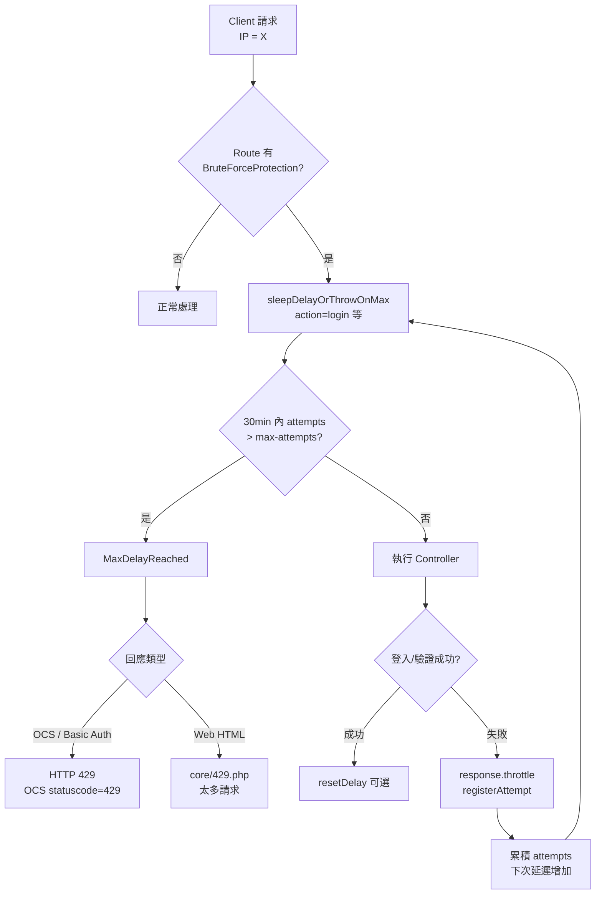
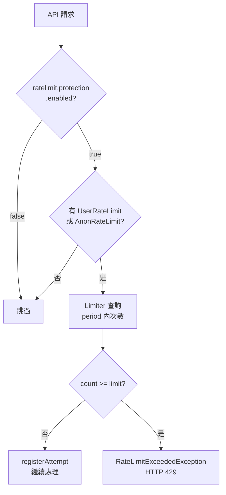
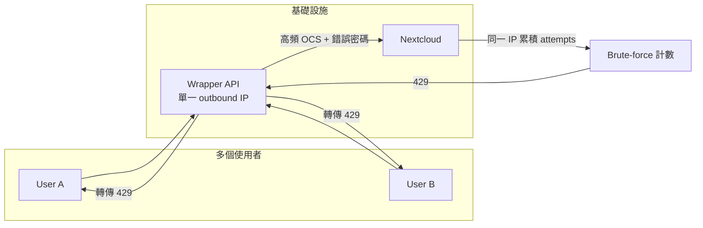

# Nextcloud HTTP 429（Too Many Requests）流程說明

## 摘要

Nextcloud **沒有**全域「每秒允許 N 次呼叫」的單一設定。429 來自兩套獨立機制：

| 機制 | 觸發條件 | 預設行為 |
|------|----------|----------|
| **Brute-force protection**（暴力破解防護） | 同一 IP/subnet 在短時間內累積過多**失敗**的安全操作（登入、OAuth 等） | 指數延遲，超過門檻後直接拒絕（429） |
| **Rate limiting**（速率限制） | 特定 API route 在設定的 `period` 內超過 `limit` 次請求 | 直接拒絕（429） |

兩者常同時出現在使用者報修場景：wrapper API 高頻呼叫 OCS + 登入失敗累積 → 同一來源 IP 被鎖。

---

## 一、Brute-force protection 何時回 429？

### 觸發條件

1. 來源 IP（經 subnet 正規化，IPv4 為單一 IP，IPv6 預設 `/56`）在 **過去 30 分鐘**內，`bruteforce_attempts` 中 `action` 對應的失敗次數 **> `auth.bruteforce.max-attempts`**（預設 **10**）。
2. 拋出 `MaxDelayReached` → HTTP **429**。

### 延遲計算（未達 429 前）

公式（`lib/private/Security/Bruteforce/Throttler.php`）：

```
delay_seconds = 0.1 × 2^attempts
若 delay_seconds > 25 → 固定 25 秒（25000 ms）
若 attempts > max-attempts → delay 直接為 max（25 秒）
```

| 累積失敗次數 (attempts) | 延遲（約） |
|------------------------|------------|
| 1 | 200 ms |
| 2 | 400 ms |
| 3 | 800 ms |
| 4 | 1.6 s（`showBruteforceWarning` 從此開始為 true） |
| 5 | 3.2 s |
| 6 | 6.4 s |
| 7 | 12.8 s |
| 8+ | 25 s（上限） |

失敗記錄預設保留 **12 小時**（`getAttempts` 的 `maxAgeHours` 預設 12）。

### 相關 config（`config/config.php`）

```php
'auth.bruteforce.protection.enabled' => true,      // 是否啟用
'auth.bruteforce.max-attempts' => 10,              // 超過後可能 429
'auth.bruteforce.protection.testing' => false,     // 測試模式：不 sleep 但仍會 429
'security.ipv6_normalized_subnet_size' => 56,     // IPv6 subnet 正規化
```

---

## 二、Rate limiting 何時回 429？

### 觸發條件

- 各 Controller method 透過 `#[UserRateLimit(limit: X, period: Y)]` 或 `#[AnonRateLimit(...)]` 宣告。
- 在 **Y 秒**的 sliding window 內，同一識別子（logged-in user UID 或 anon IP subnet hash）超過 **X 次** → `RateLimitExceededException` → HTTP **429**。

**不是每秒幾次**，而是 **每個 route 各自定義**。範例：

| Route | 限制 |
|-------|------|
| `provisioning_api` `editUserMultiValue` | 5 次 / 60 秒（per user） |
| `provisioning_api` `editUser` | 50 次 / 600 秒（per user） |

`getUsers`（OCS 使用者列表）**沒有**宣告 RateLimit，但會受 brute-force 影響（若 Basic Auth 登入失敗）。

### 覆寫單一 route 限制

```php
'ratelimit_overwrite' => [
    'provisioning_api.users.getusers' => [
        'user' => ['limit' => 300, 'period' => 3600],
        'anon' => ['limit' => 1, 'period' => 300],
    ],
],
```

Route 名稱可用 `occ router:list` 查詢（格式：`{app}.{controller}.{method}`，小寫）。

### 相關 config

```php
'ratelimit.protection.enabled' => true,   // 全域開關
```

---

## 三、429 回應路徑（程式碼定位）

### 3.1 Brute-force → 429

```
請求進入
  │
  ├─► BruteForceMiddleware::beforeController()
  │     └─► Throttler::sleepDelayOrThrowOnMax(ip, action)
  │           └─► attempts_30min > max-attempts → MaxDelayReached
  │
  ├─► Controller 執行後，失敗回應標記 throttle()
  │     └─► BruteForceMiddleware::afterController()
  │           └─► Throttler::registerAttempt() + sleepDelayOrThrowOnMax()
  │
  ├─► OCS 路徑：throw OCSException(..., 429)
  ├─► Web 路徑：TooManyRequestsResponse → core/templates/429.php
  │
  ├─► index.php catch MaxDelayReached → 429 頁面
  ├─► ocs/v1.php catch MaxDelayReached → ApiHelper::respond(429, ...)
  └─► DAV Auth catch MaxDelayReached → TooManyRequests (HTTP 429)
```

**關鍵檔案：**

| 檔案 | 角色 |
|------|------|
| `lib/private/Security/Bruteforce/Throttler.php` | 核心邏輯：計數、延遲、拋出 MaxDelayReached |
| `lib/private/AppFramework/Middleware/Security/BruteForceMiddleware.php` | AppFramework 請求攔截 |
| `lib/public/Security/Bruteforce/IThrottler.php` | 介面與常數說明 |
| `core/templates/429.php` | 「太多請求」頁面文案 |
| `index.php` (L68-82) | 非 API 請求的 429 處理 |
| `ocs/v1.php` (L62-63) | OCS API 429 處理 |
| `apps/dav/lib/Connector/Sabre/Auth.php` | WebDAV 429 |
| `core/Controller/LoginController.php` | `#[BruteForceProtection(action: 'login')]` |
| `lib/private/User/Session.php` | Basic Auth / 密碼登入失敗計數 |

### 3.2 Rate limit → 429

```
請求進入
  └─► RateLimitingMiddleware::beforeController()
        └─► Limiter::registerUserRequest / registerAnonRequest
              └─► existingAttempts >= limit → RateLimitExceededException
                    └─► afterException → TemplateResponse('core', '429') 或 DataResponse 429
```

**關鍵檔案：**

| 檔案 | 角色 |
|------|------|
| `lib/private/AppFramework/Middleware/Security/RateLimitingMiddleware.php` | 讀取 annotation/attribute |
| `lib/private/Security/RateLimiting/Limiter.php` | 計數與拋出例外 |
| `lib/private/Security/RateLimiting/Exception/RateLimitExceededException.php` | HTTP 429 |

---

## 四、流程圖

### 4.1 Brute-force 登入失敗 → 429（與 wrapper API 情境）



### 4.2 Rate limiting → 429



### 4.3 Wrapper API 典型連鎖反應



---

## 五、如何調整「允許頻率」

### Brute-force（登入失敗類）

| 需求 | 作法 |
|------|------|
| 提高失敗容忍次數 | `auth.bruteforce.max-attempts` => 20（需評估安全風險） |
| 將 wrapper / LB IP 列入白名單 | Admin → Security → Brute-force IP allow list，或 `bruteForce` app config `whitelist_*` |
| 解除目前封鎖 | `occ security:bruteforce:reset <IP>` |
| 查詢狀態 | `occ security:bruteforce:attempts <IP> [action]` |
| 完全關閉（不建議） | `auth.bruteforce.protection.enabled` => false |

### Rate limiting（API 呼叫頻率）

| 需求 | 作法 |
|------|------|
| 提高特定 API 上限 | `ratelimit_overwrite` 設定該 route 的 `limit` / `period` |
| 關閉 rate limit（不建議） | `ratelimit.protection.enabled` => false |
| 讓白名單同時套用 rate limit | bruteforcesettings app：`apply_allowlist_to_ratelimit` |

### 基礎設施（強烈建議）

- 正確設定 **reverse proxy** 的 `trusted_proxies`，確保 `getRemoteAddress()` 反映真實 client IP，避免所有流量被算成同一 IP。
- Wrapper API 應使用 **App password / token**，避免反覆用錯誤 Basic Auth 觸發 login brute-force。

---

## 六、OCS API 429 回應格式

Wrapper 看到的 `OCS API 回傳 statuscode=429` 來自：

- `BruteForceMiddleware` → `OCSException(..., Http::STATUS_TOO_MANY_REQUESTS)`
- `ocs/v1.php` → `ApiHelper::respond(Http::STATUS_TOO_MANY_REQUESTS, $ex->getMessage())`

HTTP status 與 OCS XML/JSON body 內的 `statuscode` 皆為 429（v2 格式行為一致）。

---

## 七、資料儲存

Brute-force 記錄表：`bruteforce_attempts`（subnet、ip、action、occurred、metadata）。

Rate limit 記錄：memory cache 或 database backend（依部署設定）。
