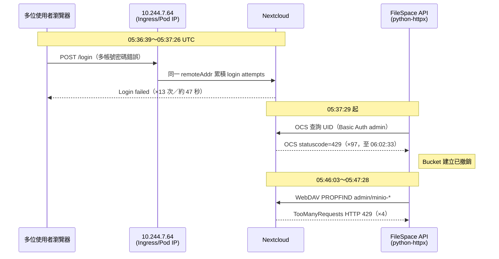
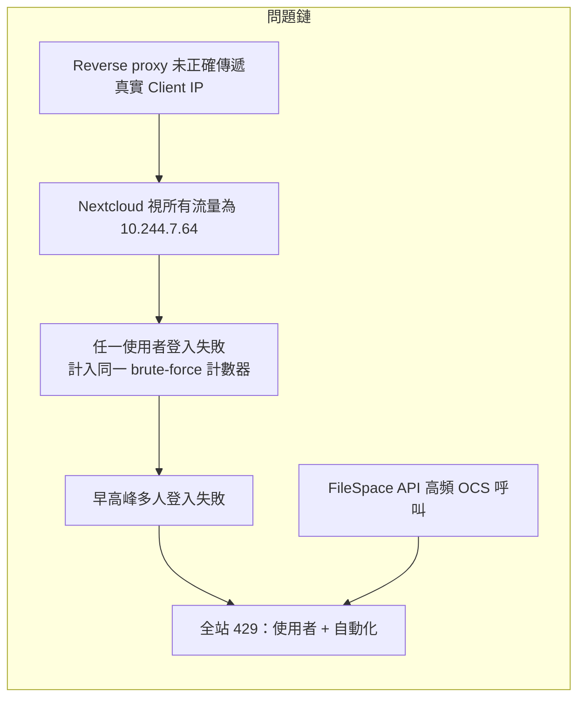
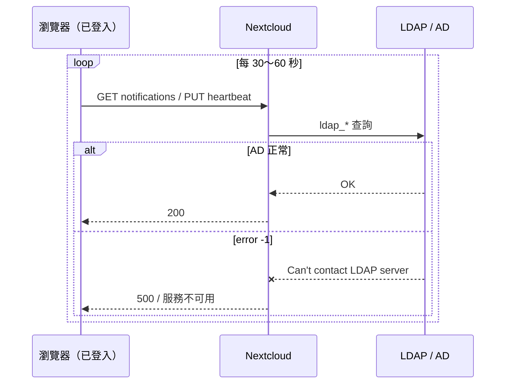

# Nextcloud Log 分析報告

**分析來源：** `ref/260610/nextcloud.log`（輔以 `bucket_api_20260414.log` 交叉比對）  
**Nextcloud 版本：** 32.0.3.2  
**分析日期：** 2026-06-12

---

## 一、總覽（Top-down）

| 項目 | 數值 |
|------|------|
| 紀錄筆數 | 970 |
| 時間範圍 | 2026-02-11 05:00 UTC ～ 2026-06-11 07:35 UTC |
| Log level 分布 | L2（info）441、L3（warn）528、L4（error）1 |
| 唯一 `remoteAddr`（登入失敗） | **僅 `10.244.7.64`**（42 次失敗全數來自此 IP） |
| 直接記錄的 HTTP 429 | **4 筆**（WebDAV `TooManyRequests`） |
| Wrapper 側 OCS 429 | **97 筆**（見 `bucket_api_20260414.log`，nextcloud.log 未直接寫入） |

此 log 檔僅收錄 **warn 以上** 或特定事件，並非完整 access log。429 在 OCS 路徑上常以 HTTP 回應形式出現，**不一定**寫入 `nextcloud.log` 的 message 欄位；需搭配 wrapper / reverse proxy log 交叉驗證。

---

## 二、重點：HTTP 429 / OCS `statuscode=429`

### 2.1 事件時間軸（2026-06-10）



| 時間（UTC） | 來源 | 現象 | 機制判斷 |
|-------------|------|------|----------|
| 05:36:39～05:37:26 | `nextcloud.log` | 13 次 `Login failed`（`POST /login`），含 `00049111`、`lydia_yen@umc.com` 等 | Brute-force：`login` action 失敗累積 |
| **05:37:29** | `bucket_api` | 首次 `OCS API 回傳 statuscode=429`（查 UID `search=00049198`） | 同一 IP 已超過 `auth.bruteforce.max-attempts`（預設 10） |
| 05:37:29～06:02:33 | `bucket_api` | **97 次** 429，高峰分鐘：05:39（19）、05:44（16）、05:37（15） | OCS 每次 Basic Auth 皆觸發 brute-force 檢查 → 持續 429 |
| 05:46:03～05:47:28 | `nextcloud.log` L903-906 | `OCA\DAV\Connector\Sabre\Exception\TooManyRequests`，`python-httpx/0.28.1`，`PROPFIND .../admin/minio-00058289/` | WebDAV Basic Auth 同樣受 brute-force 保護 |

### 2.2 為何是 Brute-force，而非 Rate limiting？

依現有紀錄與專案內 `429-flow.md` 對照：

1. **觸發前兆：** 05:36～05:37 短時間內大量 `/login` 失敗，且 **全部 `Remote IP: 10.244.7.64`**。
2. **429 發生點：** OCS「取得 UID」與 WebDAV `PROPFIND` 皆需 **Basic Auth 驗證**，失敗或已封鎖 IP 會走 `Throttler::sleepDelayOrThrowOnMax()` → `MaxDelayReached` → HTTP 429。
3. **log 中無** `RateLimitExceededException` 或 provisioning_api 專屬 rate limit 訊息。
4. **User-Agent `python-httpx/0.28.1`** 與 FileSpace / Bucket API 的 Nextcloud Rescan 行為一致。

### 2.3 根本原因（推論）



**關鍵證據：** 42 次歷史 `Login failed` 的 `remoteAddr` **100% 為 `10.244.7.64`**（疑似 K8s Pod / Ingress 內網 IP），代表 brute-force 以 **單一 IP** 計數，而非個別使用者 IP。

### 2.4 Wrapper 受影響範圍（bucket_api）

- **97 次** `statuscode=429`，集中在 **2026-06-10 05:37～06:02**（約 25 分鐘）。
- 重試最多的 `search` UID：`00049198`（50 次）、`00048556`（10）、`00057992`（10）。
- 錯誤訊息：`無法取得 Nextcloud UID` → `Nextcloud 外部儲存空間掛載失敗，已撤銷建立 Bucket`。
- **業務影響：** 該時段新 Bucket / 外部儲存自動佈建失敗。

### 2.5 429 處理建議（TO-DO）

- [ ] **立即：** `occ security:bruteforce:reset 10.244.7.64`（或實際 wrapper 出口 IP）
- [ ] **立即：** `occ security:bruteforce:attempts 10.244.7.64 login` 確認 attempts 數
- [ ] **根本：** 設定 `trusted_proxies`，確保 `X-Forwarded-For` / `X-Real-IP` 正確傳遞
- [ ] **Wrapper：** 改用 App password / token；429 時 **exponential backoff**，勿在 25 分鐘內重試 97 次
- [ ] **選項：** 將可信 FileSpace 服務 IP 加入 Brute-force allow list
- [ ] **選項：** 對高頻 OCS route 設定 `ratelimit_overwrite`（若日後確認也有 rate limit 問題）

詳細機制請見同目錄 [`429-flow.md`](./429-flow.md)、[`login-err.md`](./login-err.md)。

---

## 三、其他需注意項目

### 3.1 使用者 Quota 為 0（InsufficientStorage）— 高影響

| 項目 | 說明 |
|------|------|
| 筆數 | 48（幾乎全在 2026-06-10） |
| 訊息 | `Insufficient space in /. 0 available. Cannot create directory` |
| 路徑 | `MKCOL .../Photos/` |
| 受影響 UID 範例 | `25324976-...`、`1272AF5D-...`、`8B7B6B96-...`、`8E2E0B3B-...` 等 |

**原因：** 使用者 quota 設為 **0 B**（或計算為 0），Nextcloud 無法建立預設 `Photos` 資料夾。  
**影響：** 新使用者或 quota 未正確設定的帳號，登入後檔案介面異常。  
**建議：** 檢查 batch provision / quota 腳本；對受影響 UID 執行 `occ user:setting` 或重設 quota。

### 3.2 MySQL Deadlock（併發 WebDAV）— 中影響

| 項目 | 說明 |
|------|------|
| 筆數 | 42 |
| 訊息 | `SQLSTATE[40001]: Serialization failure: 1213 Deadlock` |
| 主要使用者 | `0B4BBE44-4CAB-491C-BE40-C292B22A482D`（大量並行上傳 Bench data） |
| 時間 | 2026-06-09～06-10 凌晨密集出現 |

**原因：** 同一使用者多檔案並行 WebDAV `PUT`，`filecache` 等表競爭鎖。  
**影響：** 單次上傳失敗，客戶端通常可重試；高併發時失敗率上升。  
**建議：** 客戶端限制並行度；必要時調整 MariaDB `innodb_deadlock_detect`、監控慢查詢。

### 3.3 LDAP 連線中斷 — 中影響（P1）

> **處理檢查清單：** 見 [`ldap-checklist.md`](./ldap-checklist.md)（occ 指令、設定鍵、巡檢表）。

#### 3.3.1 現象摘要

| 項目 | 說明 |
|------|------|
| 全 log 筆數 | **20** |
| Exception | `OC\ServerNotAvailableException` |
| 使用者可見訊息 | `Lost connection to LDAP server.` |
| 底層 LDAP 錯誤 | **error code `-1`**，訊息 **`Can't contact LDAP server`** |
| 程式位置 | `apps/user_ldap/lib/LDAP.php` → `processLDAPError()` |
| `remoteAddr` | 皆為 `10.244.7.64`（與 429 相同 proxy IP 議題） |

#### 3.3.2 與「帳密錯誤」的差異

| log 訊息 | LDAP 狀態 | 意義 |
|----------|-----------|------|
| `Lost connection to LDAP server` | 連線層失敗（code **-1**） | AD 不可達、網路斷、DC 重啟、socket 失效 |
| `Bind failed: 49: Invalid credentials` | LDAP **有回應** | 帳號或密碼錯誤，非基礎設施中斷 |
| `Login failed: 'xxx'` | 驗證流程失敗 | 可能為上述任一，或帳號格式不符 |

06-10 當日兩者皆出現：05:36 多為 bind 49 / Login failed；**06:55 起**才集中出現 `Lost connection`。

#### 3.3.3 為何「已登入」仍會觸發 LDAP？

已登入使用者的瀏覽器會定期輪詢 OCS API，請求仍可能觸發 `user_ldap` 查詢（session 驗證、使用者狀態同步等）。



**log 中實際 URL（06-10 高峰）：**

| 路徑 | 方法 | 說明 |
|------|------|------|
| `/ocs/v2.php/apps/notifications/api/v2/notifications` | GET | 通知輪詢 |
| `/ocs/v2.php/apps/user_status/api/v1/heartbeat` | PUT | 線上狀態 heartbeat |
| `/csrftoken` | GET | CSRF token 刷新 |

**User-Agent：** 皆為 Chrome/Edge 瀏覽器（非 FileSpace API）；惟 **2026-04-22** 曾有 2 筆來自 `python-httpx` 的 `/ocs/v1.php/cloud/users?search=00032254`，同樣觸發斷線 log。

#### 3.3.4 時間分布（全期間）

| 日期（UTC） | 筆數 | 備註 |
|-------------|------|------|
| 2026-03-18 | 1 | 單次 notifications 請求 |
| 2026-04-22 | 2 | FileSpace OCS 查 UID（`search=00032254`） |
| **2026-06-10** | **15** | **06:55:51～07:12:26** 密集叢發 |
| 其他日期 | 0 | — |

**2026-06-10 與其他事件關聯：**

| 時間（UTC） | 事件 |
|-------------|------|
| 05:36～05:37 | 13 次登入失敗（可能加重 AD 負載） |
| 05:37～06:02 | FileSpace OCS 429（97 次） |
| **06:55～07:12** | **LDAP 斷線 15 次** |
| 08:02 | LDAP 恢復後仍見 `Bind failed: 49`（`00049111`） |

推論：06-10 下午 LDAP 叢發較像 **AD / 網路瞬斷或 DC 切換**，而非單一使用者行為；需與 AD 維護紀錄交叉驗證。

#### 3.3.5 可能原因

| 類別 | 說明 |
|------|------|
| **AD / DC** | 維護重啟、複寫延遲、連線數上限、idle timeout 關閉閒置連線 |
| **網路** | K8s Pod ↔ AD 防火牆、NetworkPolicy、DNS 間歇失敗 |
| **Nextcloud 設定** | 僅單一 `ldapHost`、無 `ldapBackupHost`、`ldapConnectionTimeout` 過短（預設 15s） |
| **負載疊加** | 早高峰登入失敗 + 大量 OCS 呼叫後，LDAP 連線未正確重建 |
| **Pod 生命週期** | Pod 重啟 / 滾動更新後舊 LDAP socket 失效 |

#### 3.3.6 影響範圍

- 已登入使用者：通知、線上狀態、部分 AJAX 請求失敗
- FileSpace API：OCS 查使用者時回傳錯誤（如 04-22 `statuscode=996` 與斷線同一請求）
- **不影響** 已建立且無需 LDAP 驗證的 WebDAV 檔案讀寫（斷線窗口內若需 re-auth 則除外）

#### 3.3.7 處理建議（TO-DO）

- [ ] 事件當下：`occ ldap:test-config s01`（見 [`ldap-checklist.md`](./ldap-checklist.md) §1）
- [ ] Pod 內 `nc -zv <ldapHost> <port>` 確認 TCP 連通
- [ ] 向 AD 團隊查 **2026-06-10 06:55～07:12 UTC** 維護 / 告警紀錄
- [ ] 設定 `ldapBackupHost` / `ldapBackupPort`（備援 DC）
- [ ] 評估 `ldapConnectionTimeout`（例如 20～30 秒）
- [ ] 確認 `ldapAttributesForUserSearch` 含 `employeeID`（減少 OCS 搜尋重試）
- [ ] 監控：5 分鐘內 `Lost connection` ≥ 5 次即告警

### 3.4 登入失敗累積（全期間）— 與 429 直接相關

| 帳號（失敗次數） | 備註 |
|------------------|------|
| admin（8） | 含 Web UI 與外部儲存設定 |
| smg_arc304（5） | 含 OCS heartbeat 路徑 |
| 多位 `@umc.com` / 員工編號 | 06-10 05:36 集中爆發 |

**注意：** 失敗不一定代表密碼錯誤，也可能是 LDAP 暫時不可用、帳號格式不符（UID vs email）。

### 3.5 外網連線檢查逾時 — 低影響（環境預期）

| 項目 | 說明 |
|------|------|
| 筆數 | 300（`internet_connection_check`） |
| 訊息 | `Cannot connect to: https://www.nextcloud.com` 等 |
| 原因 | 內網/隔離環境無法連外網 |

**影響：** Admin「概況」頁面顯示警告，**不影響**核心檔案服務。  
**建議：** 可忽略，或於 `config.php` 關閉相關檢查。

### 3.6 App Store 連線失敗 — 低影響

- `Failed to connect to the app store`（Guzzle `ConnectException` timeout 120s）
- 同樣因無法連外，不影響已安裝 app 運作。

### 3.7 Cron / 背景任務異常 — 中低影響

| 現象 | 說明 |
|------|------|
| `Maximum execution time of 3600 seconds exceeded`（Avatar.php） | 頭像產生逾時，可能使用者過多或儲存慢 |
| `Transaction took 2988s` / `2472s` | DB 長交易，需監控 |
| App store fetch 於 cron 失敗 | 同上外網問題 |

### 3.8 外部儲存 / MinIO 相關 — 中影響

- `StorageNotAvailableException`：MinIO bucket 建立失敗（`nginx:9000` 連線問題）。
- `files_external/applicable` 高記憶體：`Request used more than 300 MB of RAM`。
- `unknown config key`（`user_ldap` / `circles`）：使用者設定遷移不完整，影響管理介面載入儲存資訊。

### 3.9 LDAP 設定精靈錯誤（初期）— 已過期

- 2026-02-11：`No LDAP Host given!`、`No LDAP Login Filter given!`（admin 設定精靈過程）。
- 屬設定階段噪音，若 LDAP 現已正常可忽略。

### 3.10 郵件無法寄送 — 低影響

- `Connection could not be established with host "127.0.0.1:25"`
- 新帳號歡迎信無法寄出，不阻擋帳號建立。

---

## 四、嚴重度分級摘要

| 嚴重度 | 議題 | 建議優先處理 |
|--------|------|--------------|
| **P0** | 429 / brute-force（單一 IP `10.244.7.64`） | 修正 proxy IP、reset brute-force、調整 FileSpace 重試策略 |
| **P1** | Quota = 0 導致 InsufficientStorage | 修正 provision / set-quota 流程 |
| **P1** | 2026-06-10 LDAP 中斷 | 查 LDAP 維運與連線設定 |
| **P2** | WebDAV Deadlock | 限制客戶端並行上傳 |
| **P3** | 外網檢查 / App Store / SMTP | 文件化為環境限制即可 |

---

## 五、診斷指令速查

```bash
# --- Brute-force / 429 ---
occ security:bruteforce:attempts 10.244.7.64 login
occ security:bruteforce:reset 10.244.7.64

# --- 使用者 quota ---
occ user:info <uid>

# --- LDAP（完整清單見 ldap-checklist.md）---
occ ldap:show-config
occ ldap:test-config s01
occ ldap:check-user <uid>
occ ldap:set-config s01 ldapBackupHost "ldap://<dc2>"
occ ldap:set-config s01 ldapConnectionTimeout "30"

# DB：近期 brute-force 紀錄
# SELECT * FROM bruteforce_attempts
# WHERE occurred > UNIX_TIMESTAMP(NOW() - INTERVAL 30 MINUTE)
# ORDER BY occurred DESC LIMIT 50;
```

---

## 六、結論

**2026-06-10 的 `statuscode=429` 事件**，主因是 **Brute-force protection**：Ingress/Pod IP `10.244.7.64` 在早高峰累積過多登入失敗後，連帶封鎖同一 IP 上的 **FileSpace API（python-httpx）** 對 OCS / WebDAV 的 admin 呼叫，導致 Bucket 自動佈建大量失敗。

`nextcloud.log` 僅直接記錄 **4 筆** WebDAV `TooManyRequests`；完整 429 規模需參考 **bucket_api log（97 筆）**。除 429 外，同日 **quota=0（InsufficientStorage）** 與 **LDAP 中斷** 亦需一併處理，否則使用者體驗仍會受影響。
