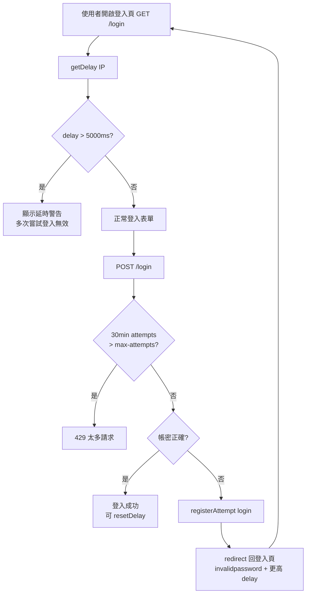

# 登入錯誤：「您的 IP 多次嘗試登入無效」說明與處理

## 一、訊息是什麼？

使用者於 UDrive 登入頁可能看到以下兩種相關文案（皆來自 Nextcloud Brute-force protection）：

| 英文原文 | 繁中（zh_TW） | 出現位置 |
|----------|---------------|----------|
| We have detected multiple invalid login attempts from your IP. Therefore your next login is throttled up to 30 seconds. | 您的 IP 多次嘗試登入無效。因此下一次登入將會被延時 30 秒。 | 舊版/自訂登入 UI、capabilities API |
| Too many incorrect login attempts. Please try again in 30 seconds. | 不正確的登入嘗試次數太多。請於 30 秒後再試一次。 | 現行 `LoginForm.vue`（`throttleDelay > 5000` ms 時） |

另有完全阻擋時的整頁錯誤：

| 英文 | 繁中 |
|------|------|
| Too many requests | 太多請求 |
| There were too many requests from your network... | 有太多請求來自您的網路，請稍後再試... |

這對應 HTTP **429**，表示已超過 `auth.bruteforce.max-attempts`（預設 10 次）且在 **30 分鐘**內仍持續觸發，系統不再接受該 IP 的登入嘗試。

---

## 二、機制說明（Top-down）

### 2.1 整體流程

1. 使用者（或程式）向帶有 `#[BruteForceProtection(action: 'login')]` 的 endpoint 發送請求。
2. **請求前**：`Throttler::sleepDelayOrThrowOnMax()` 檢查該 IP/subnet 歷史失敗次數；若 30 分鐘內超過門檻 → 直接 429。
3. **驗證失敗後**：`registerAttempt('login', ip)` 寫入 `bruteforce_attempts`。
4. **下次請求**：延遲依 `0.1 × 2^attempts` 指數成長，上限 25 秒。
5. **登入頁載入時**：`LoginController::showLoginForm()` 將 `getDelay(ip)` 傳給前端 `loginThrottleDelay`；延遲 > 5 秒時顯示警告。

### 2.2 關鍵程式碼

**登入 POST（Web UI）：**

```286:287:core/Controller/LoginController.php
	#[BruteForceProtection(action: 'login')]
```

**失敗時標記 throttle：**

```395:397:core/Controller/LoginController.php
		if ($throttle) {
			$response->throttle(['user' => substr($user, 0, 64)]);
		}
```

**Basic Auth / OCS 登入失敗計數：**

```439:447:lib/private/User/Session.php
	private function handleLoginFailed(IThrottler $throttler, int $currentDelay, string $remoteAddress, string $user, ?string $password) {
		$this->logger->warning("Login failed: '" . $user . "' (Remote IP: '" . $remoteAddress . "')", ['app' => 'core']);
		$throttler->registerAttempt('login', $remoteAddress, ['user' => $user]);
		// ...
	}
```

**前端警告條件：**

```239:253:core/src/components/login/LoginForm.vue
		isError() {
			return this.invalidPassword || this.userDisabled
				|| this.throttleDelay > 5000
		},
		errorLabel() {
			// ...
			if (this.throttleDelay > 5000) {
				return t('core', 'Too many incorrect login attempts. Please try again in 30 seconds.')
			}
```

**延遲傳入前端：**

```158:161:core/Controller/LoginController.php
		$this->initialState->provideInitialState(
			'loginThrottleDelay',
			$this->throttler->getDelay($this->request->getRemoteAddress())
		);
```

### 2.3 流程圖



---

## 三、可能原因（依常見度）

### 3.1 使用者行為

- 密碼輸入錯誤、帳號名稱錯誤（含 LDAP 同步後 UID 變更）。
- 瀏覽器自動填入過期密碼。
- 多次快速重試登入。

### 3.2 帳號 / 認證後端

- LDAP / AD 連線異常，導致所有驗證回傳失敗。
- 帳號被停用（`userdisabled`）但使用者仍反覆嘗試。
- 2FA / App password 政策變更，舊密碼不再有效。

### 3.3 基礎設施與 Proxy（高風險、常見於企業環境）

- **Reverse proxy 未正確設定**：Nextcloud 看到的 `Remote IP` 是 proxy IP 或 LB IP，**全公司使用者共用同一計數器**。
- **NAT 出口共用**：多使用者從同一公網 IP 上網，一人多次失敗會影響所有人。
- **Wrapper API 集中轉發**：所有 UDrive 流量經單一服務 outbound，該 IP 累積大量失敗登入或 Basic Auth 失敗。

### 3.4 自動化 / 整合程式

- Wrapper API 用錯誤的 admin 密碼或過期 token 反覆呼叫 OCS（`ocs/v1.php` 會先 `handleLogin` → Basic Auth）。
- 批次腳本（如 `batch_provision`、quota 設定）併發過高 + 認證失敗。
- 監控系統用錯誤憑證探測登入端點。

### 3.5 惡意或誤用

- 針對特定 IP 的暴力破解（brute-force 設計目的）。
- 惡意第三方以錯誤 Origin 觸發登入（此類不計入 throttle，見 `LoginController` `invalidOrigin`）。

### 3.6 CSRF / Session 問題（不同錯誤，但使用者可能混淆）

- Session 過期導致 `csrfCheckFailed`，不會增加 brute-force 計數（`throttle = false`）。

---

## 四、與「太多請求 / OCS 429」的關係

| 階段 | 使用者體驗 | HTTP | 說明 |
|------|------------|------|------|
| 早期 | 登入頁紅字：多次嘗試無效 / 延時 30 秒 | 200（延遲增加） | attempts ≥ 4，delay 逐漸接近 25s |
| 嚴重 | 整頁「太多請求」 | **429** | 30 分鐘內 attempts > 10 |
| Wrapper | API 回傳 OCS statuscode=429 | **429** | 同 IP 被 brute-force 封鎖 |

三者根因通常相同：**同一來源 IP 累積過多失敗登入**。

---

## 五、解決方法（TO-DO List）

### 5.1 立即緩解（營運）

- [ ] **確認被封鎖 IP**：查 Nextcloud log `IP address blocked because it reached the maximum failed attempts`。
- [ ] **解除封鎖**：`occ security:bruteforce:reset <IP>`（Docker：`docker exec ... occ security:bruteforce:reset <IP>`）。
- [ ] **查詢狀態**：`occ security:bruteforce:attempts <IP> login`。
- [ ] 告知使用者等待 **30 分鐘**後再試（若不 reset，30 分鐘窗口過後 429 會自動解除）。

### 5.2 修正 Proxy / IP 識別（根本改善）

- [ ] 設定 `trusted_proxies` 與 web server 轉發 `X-Forwarded-For` / `X-Real-IP`。
- [ ] 在 Admin → Overview 確認「Your remote address」是否為使用者真實 IP（非 proxy IP）。
- [ ] IPv6 環境檢查 `security.ipv6_normalized_subnet_size`（預設 56），避免過大 subnet 使過多使用者共用計數。

### 5.3 Wrapper API / 自動化

- [ ] 使用 **App password** 或 OAuth token，避免每次請求 Basic Auth 密碼驗證。
- [ ] 確認 ENV 中的 `ENV_NEXTCLOUD_*` 憑證正確且未過期。
- [ ] 降低併發（例如 `--concurrency`）、加入 retry with backoff；收到 429 時停止重試。
- [ ] 將 wrapper 伺服器 IP 加入 **Brute-force allow list**（僅限可信內部服務）。
- [ ] 對高頻 OCS route 設定 `ratelimit_overwrite`（若觸發的是 rate limit 而非 brute-force）。

### 5.4 使用者端

- [ ] 確認帳號、密碼；必要時透過 AD/LDAP 管理員重置。
- [ ] 清除瀏覽器儲存的舊密碼；使用「忘記密碼」流程。
- [ ] 避免在延遲警告出現後連續點擊登入。

### 5.5 設定調整（需安全評估）

- [ ] 提高 `auth.bruteforce.max-attempts`（預設 10）— 僅在確認 IP 識別正確後考慮。
- [ ] **勿**在 production 長期關閉 `auth.bruteforce.protection.enabled`。
- [ ] 除錯時可短暫使用 `auth.bruteforce.protection.testing`（不 sleep 但仍 429）。

### 5.6 調查資料庫

```sql
SELECT * FROM bruteforce_attempts
WHERE occurred > UNIX_TIMESTAMP(NOW() - INTERVAL 30 MINUTE)
ORDER BY occurred DESC
LIMIT 50;
```

觀察 `subnet`、`action`、`metadata`（含 user）以找出是單一使用者還是整段 IP 被攻擊/誤用。

---

## 六、診斷檢查清單

| 檢查項 | 指令 / 位置 | 預期 |
|--------|-------------|------|
| 該 IP 是否被封 | `occ security:bruteforce:attempts <IP>` | `attempts` > 10 表示高風險 |
| 是否在白名單 | 同上 `bypass-listed: true` | 白名單 IP 不應被封 |
| 當前延遲 | 同上 `delay`（ms） | > 5000 會顯示登入警告 |
| Server 看到的 IP | Settings → Overview / Setup check | 應為使用者 IP 而非 proxy |
| Log | `data/nextcloud.log` | `Bruteforce attempt from` / `IP address blocked` |

---

## 七、UDrive 情境推論

依截圖與 wrapper API 429 同時出現，較可能原因為：

1. **Wrapper 或公司 NAT 共用單一 IP**，自動化或多位使用者登入失敗累積計數。
2. Wrapper 以錯誤憑證高頻呼叫 OCS，每次 Basic Auth 失敗都計入 `login` action。
3. 429 後使用者仍重試，延長封鎖窗口內的 attempts。

建議優先：**修正 proxy IP 識別** → **修正 wrapper 憑證與認證方式** → **reset 被封 IP** → 必要時將可信 wrapper IP 加入 allow list。
