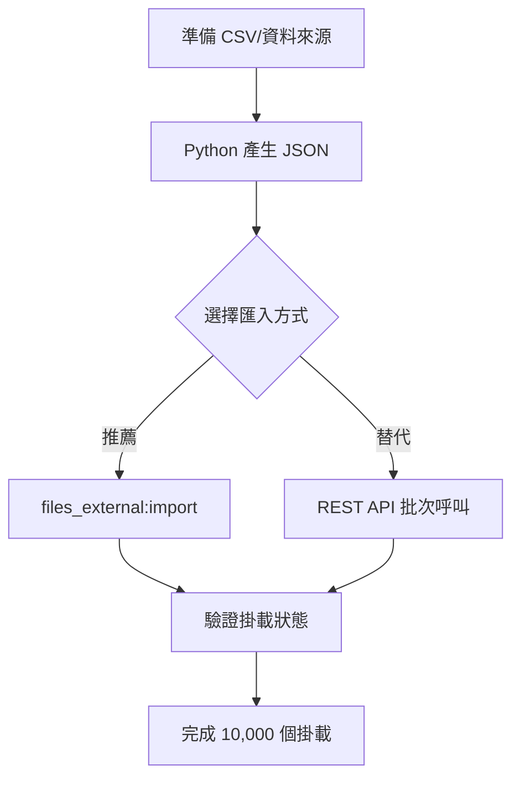
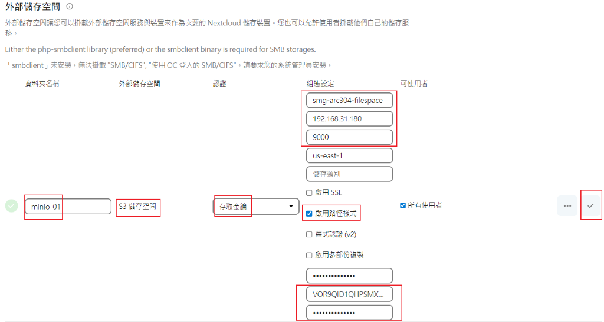

# Nextcloud External Storage Support API 研究報告

## 研究目標

研究 Nextcloud External Storage Support API，以便使用 Python 自動化建立約 10,000 個 S3 外部儲存掛載點，避免手動逐一建立。

---

## 研究發現

### 1. 可用方法概述

| 方法 | 適用場景 | 效率 |
|------|----------|------|
| **OCC 指令** `files_external:create` | 單筆建立，適合腳本呼叫 | 中 |
| **OCC 指令** `files_external:import` | JSON 批次匯入 | **高**（推薦） |
| **REST API** `/apps/files_external/globalstorages` | HTTP POST 建立 | 中 |

### 2. 推薦方案：`files_external:import` + JSON 批次匯入

發現 Nextcloud 的 `files_external:import` 指令支援從 JSON 檔案批次匯入掛載設定，這是批次建立 10,000 個目錄的最佳方式。

---

## 核心參數結構

### S3 Backend 識別碼

- **Storage Backend**: `amazons3`
- **Authentication Backend**: `amazons3::accesskey`

### backendOptions（S3 設定參數）

| 參數名稱 | 說明 | 必填 | 範例值 |
|----------|------|------|--------|
| `bucket` | S3 Bucket 名稱 | ✅ | `smg-arc304-filespace` |
| `hostname` | S3 主機位址 | 選填 | `192.168.31.180` |
| `port` | 連接埠 | 選填 | `9000` |
| `region` | AWS Region | 選填 | `us-east-1` |
| `use_ssl` | 啟用 SSL | 選填 | `false` |
| `use_path_style` | 啟用 Path Style | 選填 | `true` |
| `legacy_auth` | V2 Legacy 認證 | 選填 | `false` |
| `key` | Access Key | ✅ | `VOR9QID1QHPSMX...` |
| `secret` | Secret Key | ✅ | `**********` |

---

## 方法一：OCC Import（推薦）

### JSON 格式範例

```json
[
  {
    "mount_id": 1,
    "mount_point": "/minio-user00001",
    "storage": "\\OCA\\Files_External\\Lib\\Storage\\AmazonS3",
    "authentication_type": "amazons3::accesskey",
    "configuration": {
      "bucket": "minio-user00001-filespace",
      "hostname": "192.168.31.180",
      "port": "9000",
      "region": "us-east-1",
      "use_ssl": false,
      "use_path_style": true,
      "key": "ACCESS_KEY_00001",
      "secret": "SECRET_KEY_00001"
    },
    "options": {},
    "applicable_users": [],
    "applicable_groups": []
  },
  {
    "mount_id": 2,
    "mount_point": "/minio-user00002",
    "storage": "\\OCA\\Files_External\\Lib\\Storage\\AmazonS3",
    "authentication_type": "amazons3::accesskey",
    "configuration": {
      "bucket": "minio-user00002-filespace",
      "hostname": "192.168.31.180",
      "port": "9000",
      "region": "us-east-1",
      "use_ssl": false,
      "use_path_style": true,
      "key": "ACCESS_KEY_00002",
      "secret": "SECRET_KEY_00002"
    },
    "options": {},
    "applicable_users": [],
    "applicable_groups": []
  }
]
```

### OCC 匯入指令

```bash
# 預覽（不儲存）
php occ files_external:import --dry mounts.json

# 正式匯入
php occ files_external:import mounts.json
```

---

## 方法二：OCC Create（單筆）

```bash
php occ files_external:create \
  -c bucket=minio-user00001-filespace \
  -c hostname=192.168.31.180 \
  -c port=9000 \
  -c region=us-east-1 \
  -c use_ssl=false \
  -c use_path_style=true \
  -c key=ACCESS_KEY_00001 \
  -c secret=SECRET_KEY_00001 \
  minio-user00001 amazons3 amazons3::accesskey
```

---

## 方法三：REST API

### API Endpoint

```
POST /apps/files_external/globalstorages
```

### 認證方式

- Basic Auth（管理員帳號）
- OCS-APIRequest Header: `true`

### Request Body 範例

```json
{
  "mountPoint": "/minio-user00001",
  "backend": "amazons3",
  "authMechanism": "amazons3::accesskey",
  "backendOptions": {
    "bucket": "minio-user00001-filespace",
    "hostname": "192.168.31.180",
    "port": "9000",
    "region": "us-east-1",
    "use_ssl": false,
    "use_path_style": true,
    "key": "ACCESS_KEY_00001",
    "secret": "SECRET_KEY_00001"
  },
  "applicableUsers": [],
  "applicableGroups": [],
  "priority": 100
}
```

> [!WARNING]
> REST API 需要 `PasswordConfirmationRequired` 屬性通過，可能需要額外的密碼確認機制。

---

## Python 自動化範例

```python
import json

def generate_mounts_json(
    start_num: int = 1,
    end_num: int = 10001,
    bucket_prefix: str = "minio-user",
    hostname: str = "192.168.31.180",
    port: str = "9000",
    region: str = "us-east-1",
    access_keys: dict[str, tuple[str, str]] = None  # {user_id: (access_key, secret_key)}
) -> list[dict]:
    """
    產生 Nextcloud External Storage 掛載設定 JSON
    
    Args:
        start_num: 起始編號 (含)
        end_num: 結束編號 (不含)
        bucket_prefix: Bucket 名稱前綴
        hostname: MinIO 主機位址
        port: 連接埠
        region: AWS Region
        access_keys: 每個使用者的 Access Key/Secret Key 對應表
    
    Returns:
        掛載設定清單
    """
    mounts = []
    
    for i in range(start_num, end_num):
        user_id = f"{bucket_prefix}{i:05d}"
        bucket_name = f"{user_id}-filespace"
        
        # 從對應表取得 Key，或使用預設值
        if access_keys and user_id in access_keys:
            access_key, secret_key = access_keys[user_id]
        else:
            access_key = f"ACCESS_KEY_{i:05d}"
            secret_key = f"SECRET_KEY_{i:05d}"
        
        mount = {
            "mount_id": i,
            "mount_point": f"/{user_id}",
            "storage": "\\OCA\\Files_External\\Lib\\Storage\\AmazonS3",
            "authentication_type": "amazons3::accesskey",
            "configuration": {
                "bucket": bucket_name,
                "hostname": hostname,
                "port": port,
                "region": region,
                "use_ssl": False,
                "use_path_style": True,
                "key": access_key,
                "secret": secret_key
            },
            "options": {},
            "applicable_users": [],
            "applicable_groups": []
        },
        mounts.append(mount)
    
    return mounts


def save_mounts_json(mounts: list[dict], output_path: str = "mounts.json"):
    """儲存掛載設定為 JSON 檔案"""
    with open(output_path, "w", encoding="utf-8") as f:
        json.dump(mounts, f, indent=2, ensure_ascii=False)
    print(f"已產生 {len(mounts)} 個掛載設定至 {output_path}")


if __name__ == "__main__":
    # 範例：產生 minio-user00001 到 minio-user10001
    mounts = generate_mounts_json(
        start_num=1,
        end_num=10001,
        bucket_prefix="minio-user",
        hostname="192.168.31.180",
        port="9000"
    )
    save_mounts_json(mounts, "nextcloud_mounts.json")
```

---

## 使用流程



---

## 參考檔案

| 檔案 | 路徑 |
|------|------|
| Create 指令 | [Create.php](file:///d:/_Code/_GitHub/nextcloud-server-260102/apps/files_external/lib/Command/Create.php) |
| Import 指令 | [Import.php](file:///d:/_Code/_GitHub/nextcloud-server-260102/apps/files_external/lib/Command/Import.php) |
| S3 Backend | [AmazonS3.php](file:///d:/_Code/_GitHub/nextcloud-server-260102/apps/files_external/lib/Lib/Backend/AmazonS3.php) |
| AccessKey 認證 | [AccessKey.php](file:///d:/_Code/_GitHub/nextcloud-server-260102/apps/files_external/lib/Lib/Auth/AmazonS3/AccessKey.php) |
| REST API Controller | [GlobalStoragesController.php](file:///d:/_Code/_GitHub/nextcloud-server-260102/apps/files_external/lib/Controller/GlobalStoragesController.php) |
| OpenAPI 規格 | [openapi.json](file:///d:/_Code/_GitHub/nextcloud-server-260102/apps/files_external/openapi.json) |

---

## 原始需求螢幕截圖


