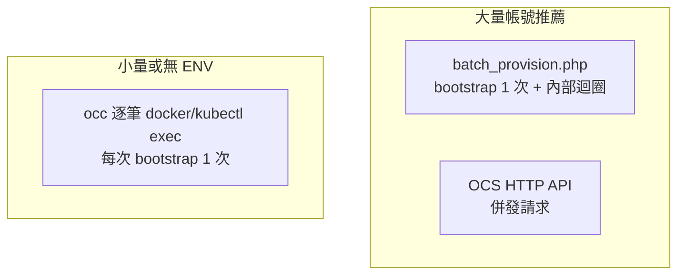
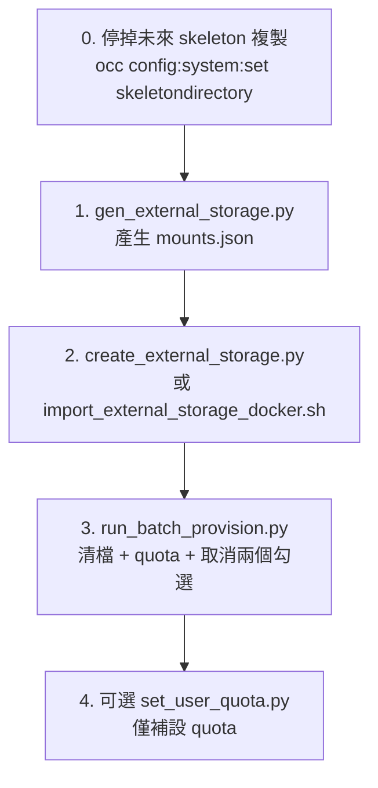
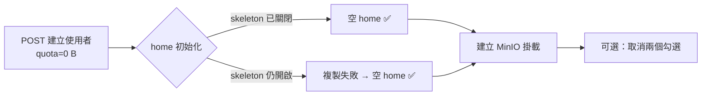

# Nextcloud 管理工具 (tools/)

本目錄提供 Nextcloud 與 MinIO 外部儲存、帳號配額、Files 偏好設定的批次管理腳本。

- **執行環境**：`run_batch_provision.py`、`set_user_quota.py` 支援 **Docker** 與 **Kubernetes**（`--runtime docker|k8s`）
- **Python 套件管理**：[uv](https://docs.astral.sh/uv/)（`pyproject.toml`）
- **預設排除 `admin`**：`--all` 時自動跳過管理員帳號
- **ENV 可選**：無 `ENV_NEXTCLOUD_*` 時，可透過容器內 `occ` 取得使用者列表與設定 quota

**快速開始（單一帳號測試 Q3）**：

```bash
cd tools
uv sync
uv run python run_batch_provision.py --users 00059094 -c <容器> --apply --cleanup-trash
```

**快速開始（全部帳號，排除 admin）**：

```bash
uv run python run_batch_provision.py --all -c <容器> --apply --cleanup-trash
```

---

## 目錄結構

| 檔案 | 類型 | 用途 |
|------|------|------|
| `tools_external_storage.py` | Python 模組 | 外部儲存 API、MinIO 設定、logger 共用 |
| `tools_user_admin.py` | Python 模組 | OCS 使用者列表（分頁）、OCS/occ 設定 quota |
| `tools_runtime.py` | Python 模組 | Docker / K8s 執行環境抽象（cp、exec、chown） |
| `gen_external_storage.py` | Python | 從 CSV 產生 `mounts.json` |
| `create_external_storage.py` | Python | 依 `mounts.json` 透過 API 建立外部儲存 |
| `set_user_quota.py` | Python | 批次設定 quota（OCS 併發或 occ，預設排除 admin） |
| `run_batch_provision.py` | Python | **主流程**：清 skeleton、設 quota、設 Files 偏好（驅動 PHP） |
| `batch_provision.php` | PHP | 單次 bootstrap 批次處理（在容器內執行） |
| `set_files_settings_docker.sh` | Bash | 少量帳號用 `occ` 設 Files 偏好（不建議 1 萬筆） |
| `import_external_storage_docker.sh` | Bash | `occ files_external:import` 匯入掛載 |
| `import_external_storage_k8s.sh` | Bash | k8s 版匯入（本 README 不展開） |
| `pyproject.toml` / `uv.lock` | uv 專案 | Python 相依與鎖定版本 |
| `mounts.json` / `files_external-sample.json` | 資料 | 掛載設定範例 |

日誌預設寫入 `tools/logs/`（執行時自動建立）。

---

## 環境變數

在專案根目錄或 `tools/` 放置 `.env`（`python-dotenv` 會自動載入）：

| 變數 | 說明 |
|------|------|
| `ENV_NEXTCLOUD_URL` | Nextcloud 基底 URL，例如 `https://nc.example.com` |
| `ENV_NEXTCLOUD_USER` | 管理員帳號 |
| `ENV_NEXTCLOUD_PASSWORD` | 管理員密碼 |
| `ENV_MINIO_URL` | MinIO URL，例如 `http://minio:9000` |
| `ENV_MINIO_ACCESS_KEY` | S3 Access Key |
| `ENV_MINIO_SECRET_KEY` | S3 Secret Key |
| `ENV_REGION` | S3 Region（預設 `us-east-1`） |

**哪些腳本需要 `ENV_NEXTCLOUD_*`？**

| 腳本 | 是否必須 ENV |
|------|----------------|
| `create_external_storage.py` | ✅ 必須 |
| `gen_external_storage.py`（部分流程） | ✅ 視參數而定 |
| `run_batch_provision.py --all` | ❌ 可選（無 ENV 時用 `occ user:list`） |
| `set_user_quota.py`（全部帳號） | ❌ 可選（無 ENV 時用 `occ`；有 ENV 時 OCS 併發較快） |
| `run_batch_provision.py --users` | ❌ 不需要 |

Python 腳本請在 **`tools/` 目錄**下執行，並以 **`uv run python`** 執行。

### Python 環境（uv）

本目錄為 **[uv](https://docs.astral.sh/uv/)** 專案（`pyproject.toml`）。Debian/Ubuntu 等系統若出現 `externally-managed-environment`，請用 uv，勿對系統 Python 直接 `pip install`。

**安裝 uv**（擇一）：

```bash
# Linux / macOS
curl -LsSf https://astral.sh/uv/install.sh | sh

# 或 pipx（同樣不污染系統 site-packages）
pipx install uv
```

**初次設定**：

```bash
cd tools
uv sync                              # 建立 .venv 並安裝相依套件
uv run python run_batch_provision.py --help
```

**之後執行腳本**（無需手動 `activate`）：

```bash
cd tools
uv run python set_user_quota.py --dry-run
uv run python run_batch_provision.py --users <uid> --apply
uv run python create_external_storage.py --dry-run
```

新增相依套件：

```bash
cd tools
uv add <package>
```

Python 版本由 `.python-version` 指定（預設 3.12）；uv 會自動下載對應 interpreter（若本機沒有）。

---

## 需求對照

| 需求 | 做法 | 建議工具 |
|------|------|----------|
| **Q1** 禁止在個人空間新增檔案，只用外部 MinIO | 將 home **quota 設為 `0 B`**；外部掛載預設不計入 quota | `set_user_quota.py` 或 `run_batch_provision.py` |
| **Q2** 批次取消「檔案設定 → 其他設定」兩個勾選 | 寫入 `oc_preferences`（`recommendations/enabled`、`text/workspace_enabled`） | `run_batch_provision.py`（大量）或 `set_files_settings_docker.sh`（少量） |
| **Q3** 清掉新帳號自帶的 skeleton（約 54.8MB）並設 quota=0 | 刪除 home 內範本檔 + 設 quota + 停掉未來 skeleton 複製 | `run_batch_provision.py` + 一次性 `occ` 系統設定 |

### 原理摘要

- **Quota**：只包在 `HomeMountPoint` 上；`quota_include_external_storage` 預設 `false`，故 **quota=0 不影響 MinIO 掛載**。
- **Skeleton**：新帳號建立時會從 `core/skeleton` 複製示範檔；若建立時已是 quota=0，複製常因空間不足被靜默略過（home 為空）。
- **大量帳號（約 1 萬）**：避免 bash 迴圈逐筆 `occ`（每次完整 bootstrap PHP）。**清檔必須用 PHP 檔案 API**；**設 quota 可用 OCS 併發**；**清檔 + quota + 其他設定 合併** 用 `batch_provision.php` 只 bootstrap 一次。
- **`--all` 預設排除 `admin`**；要包含 admin 請加 `--no-exclude`。

---

## 執行環境與效能：OCS / occ / batch_provision

本目錄有三種與 Nextcloud 互動的方式，效能差異極大：



### 什麼是 bootstrap？

執行 `php occ ...` 或 `php batch_provision.php` 時，Nextcloud 會先完整初始化：

1. 載入 `lib/base.php`、`config.php`
2. 連線資料庫、載入 apps、DI 容器
3. 初始化檔案系統等子系統
4. 才執行實際指令（設 quota、刪檔等）

單次 occ 通常需 **0.5～2 秒**，其中絕大部分花在啟動，而非寫入那一筆設定。

### 三種方式對照

| 方式 | 機制 | 1 萬使用者 bootstrap 次數 | 粗估耗時 | 需要 ENV |
|------|------|---------------------------|----------|----------|
| **`batch_provision.php`** | `docker/kubectl exec` **一次**，PHP 內迴圈 | **1 次** | 數秒～數分 | ❌ |
| **OCS API** | HTTP `PUT /ocs/v2.php/cloud/users/{uid}`，可併發 | Web worker 處理 | 約 1～3 分 | ✅ |
| **occ 逐筆** | 每位使用者一次 `docker exec php occ ...` | **~N 次** | 數小時（N≈1萬） | ❌ |

### 為何 `set_user_quota.py` occ 模式不併發？

`occ` 模式下每次設定都會：

```bash
docker exec -u www-data <容器> php occ user:setting <uid> files quota 0
```

這會啟動**全新的 PHP CLI 行程**，完整 bootstrap 後才寫入 `oc_preferences`，然後結束。

若同時並行 20 個 `docker exec occ`：

- 容器 CPU / 記憶體被 20 份 Nextcloud 搶占
- 資料庫連線與 lock 競爭加劇
- 很少線性加速，反而容易 OOM 或逾時

因此 `set_user_quota.py` 在 occ 模式**固定循序執行**（`concurrency=1`）。人數少（幾十～幾百）可接受；**1 萬筆請設 ENV 走 OCS**，或改用 `run_batch_provision.py --all`。

### 工具選擇建議

| 情境 | 建議工具 |
|------|----------|
| 清 skeleton + quota + 取消兩個勾選（大量） | `run_batch_provision.py --all` |
| 只改 quota（有 ENV，大量） | `set_user_quota.py`（OCS 併發） |
| 只改 quota（無 ENV，少量） | `set_user_quota.py -c <容器>`（occ 循序） |
| 只取消兩個勾選（少量） | `set_files_settings_docker.sh` |
| 建立 MinIO 掛載 | `create_external_storage.py` |

### 自行驗證 bootstrap 耗時

```bash
time docker exec -u www-data chad-nextcloud-1 php occ user:info admin
# 連續執行 3 次 ≈ 3 倍時間 → 即為「每次 occ 都要付的啟動成本」
```

---

## 建議作業順序



### 步驟 0：一次性（新帳號不再複製範本檔）

```bash
docker exec -u www-data <容器> php occ config:system:set skeletondirectory --value=""
docker exec -u www-data <容器> php occ config:system:set templatedirectory --value=""
```

### 步驟 1–2：外部儲存 (MinIO)

```bash
cd tools

# 從 CSV 產生 mounts.json
uv run python gen_external_storage.py --csv ../import/import-accounts.csv --output import/mounts.json

# 方式 A：透過 HTTP API 建立（需 ENV_NEXTCLOUD_*）
uv run python create_external_storage.py --mounts-file import/mounts.json --dry-run
uv run python create_external_storage.py --mounts-file import/mounts.json

# 方式 B：透過 occ 匯入
./import_external_storage_docker.sh import/mounts.json
```

### 步驟 3：批次帳號處理（Q1 + Q2 + Q3）

**Q2 對應的兩個勾選**（位於「檔案設定 → 其他設定」，由外部 app 註冊，**不在** `UserConfig.php`）：

| UI 顯示 | app | key |
|---------|-----|-----|
| Show recommendations | `recommendations` | `enabled` |
| Show folder description | `text` | `workspace_enabled` |

可先 inspect 確認：

```bash
docker exec -u www-data <容器> php occ user:setting <某帳號> recommendations
docker exec -u www-data <容器> php occ user:setting <某帳號> text
```

**乾跑（預設，不變更；預設取消兩個勾選、排除 admin）**：

```bash
# 無 ENV 也可（自動 occ user:list）
uv run python run_batch_provision.py --all -c chad-nextcloud-1
```

**正式執行**：

```bash
uv run python run_batch_provision.py --all -c chad-nextcloud-1 --apply --cleanup-trash
```

**只處理指定帳號**（不受 `--exclude` 影響）：

```bash
uv run python run_batch_provision.py --users 00059094 -c chad-nextcloud-1 --apply --cleanup-trash
```

**跳過 Q2（不取消兩個勾選）**：

```bash
uv run python run_batch_provision.py --all -c chad-nextcloud-1 --apply --skip-additional-settings
```

**也要處理 admin**：

```bash
uv run python run_batch_provision.py --all -c chad-nextcloud-1 --apply --no-exclude
```

**從檔案讀取帳號清單**（每行一個 uid）：

```bash
uv run python run_batch_provision.py --users-file users.txt -c chad-nextcloud-1 --apply
```

**Kubernetes**：

```bash
uv run python run_batch_provision.py --runtime k8s -n nextcloud -p nextcloud-0 --all --apply
```

容器內 PHP 路徑若非預設，可指定：

```bash
uv run python run_batch_provision.py --all -c chad-nextcloud-1 --apply --base /var/www/html/lib/base.php
```

---

## 新建帳號時直接設定 quota=0 B（Provisioning API）

管理介面「新帳號 → 容量限額 = 0 B」的程式化對應，為 **OCS Provisioning API** 建立使用者時帶上 `quota` 參數（見 `apps/provisioning_api/lib/Controller/UsersController.php::addUser`）。

### 為何要在「建立當下」就設 quota？

| 時機 | 行為 |
|------|------|
| 建立時 **未** 設 quota | 使用預設配額；首次初始化 home 時會從 `core/skeleton` 複製示範檔（約 **54.8 MB**） |
| 建立時 **已** 設 `quota=0 B` | 複製 skeleton 因空間不足失敗（`NotPermittedException` 被略過），home 通常為空 |
| 系統已設 `skeletondirectory=""` | 無論 quota，都不會再複製範本檔（**建議與 quota 一併設定**） |

新建帳號的建議組合：

1. **步驟 0**（一次性）：`skeletondirectory=""`、`templatedirectory=""`
2. **建立帳號**：OCS `POST /ocs/v2.php/cloud/users`，`quota=0 B`（或 `0`）
3. **外部儲存**：`create_external_storage.py` 或 `files_external:import`（該使用者的 MinIO 掛載）
4. **取消兩個勾選**（可選）：`run_batch_provision.py --users <uid> --apply --clear-files none --no-quota`（帳號已是空的則不必清檔）



### API：建立使用者（含 quota）

**端點**：`POST /ocs/v2.php/cloud/users`  
**認證**：Basic Auth（管理員）  
**標頭**：`OCS-APIRequest: true`  
**Body**：`application/x-www-form-urlencoded`（表單欄位，非 JSON）

| 欄位 | 必填 | 說明 |
|------|------|------|
| `userid` | ✅ | 登入帳號 ID |
| `password` | ✅* | 密碼；若留空需搭配 `email` 走重設信流程 |
| `displayName` | | 顯示名稱 |
| `email` | | 電子郵件 |
| `groups[]` | | 群組（可重複欄位或陣列，依客戶端而定） |
| **`quota`** | | **`0 B` 或 `0`**（與管理介面「0 B」相同效果） |
| `language` | | 介面語系，例如 `zh_TW` |

**curl 範例**（請替換 URL、帳密與 userid）：

```bash
curl -X POST "https://<NC_HOST>/ocs/v2.php/cloud/users" \
  -u "admin:<password>" \
  -H "OCS-APIRequest: true" \
  -H "Accept: application/json" \
  -d "userid=00059094" \
  -d "password=<secure-password>" \
  -d "displayName=00059094" \
  -d "quota=0%20B"
```

**建立後修改 quota**（既有帳號或建立時未帶 quota）：

```bash
curl -X PUT "https://<NC_HOST>/ocs/v2.php/cloud/users/00059094" \
  -u "admin:<password>" \
  -H "OCS-APIRequest: true" \
  -d "key=quota" \
  -d "value=0%20B"
```

等同本目錄的 `set_user_quota.py`（支援 `--users` 或全部帳號併發）。

### Python 範例（httpx）

與 `tools_user_admin.py` / `set_user_quota.py` 相同環境變數：

```python
import httpx
import os

url = os.environ["ENV_NEXTCLOUD_URL"].rstrip("/")
auth = (os.environ["ENV_NEXTCLOUD_USER"], os.environ["ENV_NEXTCLOUD_PASSWORD"])
headers = {"OCS-APIRequest": "true", "Accept": "application/json"}

# 建立使用者（quota=0 B）
r = httpx.post(
    f"{url}/ocs/v2.php/cloud/users",
    auth=auth,
    headers=headers,
    data={
        "userid": "00059094",
        "password": "ChangeMe123!",
        "displayName": "00059094",
        "quota": "0 B",
    },
    timeout=60.0,
)
r.raise_for_status()
meta = r.json().get("ocs", {}).get("meta", {})
assert meta.get("statuscode") in (100, 200), meta
```

### 與批次工具的銜接

| 情境 | 做法 |
|------|------|
| **新帳號**（Provisioning 已帶 `quota=0 B` + 已關 skeleton） | 通常 **不必** 再跑 `run_batch_provision` 清檔；只需掛載 MinIO + 可選取消兩個勾選 |
| **舊帳號**（已有 54.8 MB 範本檔） | `run_batch_provision.py --apply`（清 skeleton + quota + 取消兩個勾選） |
| **只補 quota** | `set_user_quota.py --users <uid>` |

### 注意事項

- `quota` 合法值還包含 `default`、`none`、數字或人類可讀大小（如 `10 GB`）；本專案鎖定個人空間時請用 **`0` 或 `0 B`**，勿用 `none`（`none` 在部分設定代表「無限制」）。
- Provisioning API **無法**在建立時一併寫入他人 `recommendations` / `text` 偏好（Q2）；建立後請用 `run_batch_provision.py` 或 `occ user:setting`。
- 更多 HTTP 範例見專案根目錄 [`ref/api-nextcloud.http`](../ref/api-nextcloud.http)（使用者建立 / 修改 quota 小節）。

---

## 各工具說明

### `run_batch_provision.py`（大量帳號主流程）

支援 **Docker** 與 **Kubernetes**（`--runtime docker|k8s`），遠端執行的 `batch_provision.php` 邏輯相同。

**Docker（預設）**

```bash
uv run python run_batch_provision.py --users 00059094 -c chad-nextcloud-1 --apply --cleanup-trash
```

**Kubernetes**

```bash
uv run python run_batch_provision.py \
  --runtime k8s -n nextcloud -p nextcloud-0 \
  --users 00059094 --apply --cleanup-trash
```

| 參數 | 說明 |
|------|------|
| `--runtime` | `docker`（預設）或 `k8s` |
| `--all` | 處理所有使用者（`auto`：有 ENV 用 OCS，否則 `occ user:list`） |
| `--user-source` | `auto`（預設）/ `ocs` / `occ` |
| `--exclude` | `--all` 時排除帳號（預設 `admin`） |
| `--no-exclude` | `--all` 時不排除任何帳號 |
| `--users` | 逗號分隔的帳號列表 |
| `--users-file` | 每行一個帳號的檔案 |
| `--clear-files` | `skeleton`（預設，只刪白名單）/ `all` / `none` |
| `--quota` | 預設 `0 B` |
| `--no-quota` | 不變更 quota |
| `--skip-additional-settings` | 跳過 Q2（不取消「其他設定」兩個勾選） |
| `--apply` | **必須加上才會實際執行**（否則為乾跑） |
| `--cleanup-trash` | 完成後執行 `occ trashbin:cleanup` |
| `-c, --container` | **[docker]** 容器名稱（預設自動偵測名稱含 `nextcloud`） |
| `-n, --namespace` | **[k8s]** 命名空間（預設 `default`） |
| `-p, --pod` | **[k8s]** Pod 名稱（預設依 label 自動偵測） |
| `--label-selector` | **[k8s]** 自動偵測 Pod 的 label（預設 `app=nextcloud`） |

**Skeleton 清單**（`--clear-files skeleton`）：

- `batch_provision.php` 會**自動掃描**容器內 `core/skeleton` 頂層檔名（含 `Templates credits.md` 等），並併入 Python 傳入的 fallback 清單。
- 另納入語系化範本資料夾名稱（如 `範本`），因 `Templates` 資料夾建立後可能被重新命名。
- 若仍有殘留，可改用 `--clear-files all`（會清空整個 home，請謹慎）。

流程：產生 `batch_config.json` → 複製腳本與設定（`docker cp` 或 `kubectl cp`）→ 遠端執行 `php batch_provision.php`。

### `batch_provision.php`（容器內執行）

通常由 `run_batch_provision.py` 呼叫，勿手動執行除非除錯：

```bash
# Docker
docker exec -u www-data <容器> php /tmp/batch_provision.php /tmp/batch_config.json

# Kubernetes
kubectl exec -n <ns> <pod> -u www-data -- php /tmp/batch_provision.php /tmp/batch_config.json
```

`config.json` 欄位：`users`, `clear_files`, `skeleton_names`, `set_quota`, `user_settings`, `dry_run`。

`user_settings` 範例（Q2 預設值）：

```json
{
  "recommendations": { "enabled": "0" },
  "text": { "workspace_enabled": "0" }
}
```

### `set_user_quota.py`（僅設 quota）

適合帳號 home **已是空的**、只需改 quota 時（比跑完整 PHP 批次更輕）。

```bash
# 無 ENV，Docker + occ（預設排除 admin）
uv run python set_user_quota.py --dry-run -c chad-nextcloud-1

# 有 ENV 時自動用 OCS 併發（大量帳號較快）
uv run python set_user_quota.py --dry-run

# 指定帳號（不受 exclude 影響）
uv run python set_user_quota.py --users uid1,uid2 -c chad-nextcloud-1

# Kubernetes（occ 模式）
uv run python set_user_quota.py --runtime k8s -n nextcloud -p nextcloud-0 --dry-run
```

| 參數 | 說明 |
|------|------|
| `--runtime` | `docker`（預設）或 `k8s` |
| `--quota` | 預設 `0` |
| `--users` | 指定帳號；未指定則全部 |
| `--exclude` | 預設 `admin`（僅在未指定 `--users` 時） |
| `--no-exclude` | 不排除任何帳號 |
| `--user-source` | `auto` / `ocs` / `occ`（使用者列表） |
| `--quota-backend` | `auto` / `ocs` / `occ`（設定 quota；auto 有 ENV 用 OCS） |
| `-c` / `-n` / `-p` | Docker 容器或 K8s 命名空間 / Pod |
| `--concurrency` | OCS 併發數，預設 `20`；**occ 模式固定循序（見上文）** |
| `--dry-run` | 預覽 |

### `set_files_settings_docker.sh`（少量帳號，僅 Q2）

逐筆 `occ user:setting`，**不建議 1 萬筆**（每次 bootstrap PHP）。固定取消兩個勾選：

```bash
./set_files_settings_docker.sh --inspect <uid>
./set_files_settings_docker.sh --dry-run
./set_files_settings_docker.sh -y
```

### `gen_external_storage.py` / `create_external_storage.py`

- **gen**：CSV → `mounts.json`（支援斷點續傳、SHA256 變更偵測）。
- **create**：比對現有 amazons3 bucket，缺則 POST 建立。

### `import_external_storage_docker.sh`

將 `mounts.json` 複製進容器後執行 `occ files_external:import`（含 dry-run 預覽）。

---

## 效能參考（約 1 萬使用者）

| 方式 | bootstrap 次數 | 預估耗時 | 適用 |
|------|----------------|----------|------|
| `run_batch_provision.py` + `batch_provision.php` | **1 次** | 數秒～數分鐘 | 清檔 + quota + 取消兩個勾選 ✅ |
| `set_user_quota.py`（OCS，併發 20） | Web worker | 約 1～3 分鐘 | 僅 quota ✅ |
| `set_user_quota.py`（occ 循序） | **~N 次** | 數小時 | 僅 quota，無 ENV ❌ |
| `set_files_settings_docker.sh`（occ 逐筆） | **~N 次** | 數小時 | 僅 Q2 ❌ |
| bash 迴圈 `occ user:setting` | **~N 次** | 數小時 | ❌ 請改用上方工具 |

> N = 使用者數。單次 occ bootstrap 約 0.5～2 秒時，1 萬人粗估 **1.4～5.5 小時**（僅供量級參考）。

---

## 安全與注意事項

1. **預設乾跑**：`run_batch_provision.py` 必須加 `--apply` 才會寫入。
2. **清檔**：預設 `skeleton` 只刪白名單；`--clear-files all` 會清空整個 home，請謹慎。
3. **垃圾桶**：刪除的檔案預設進垃圾桶；要釋放空間請加 `--cleanup-trash` 或手動 `occ trashbin:cleanup`。
4. **Quota=0**：主要阻擋佔空間的寫入；空資料夾理論上仍可能建立。若要硬擋所有寫入，需另裝 **Files Access Control** app（非本目錄工具）。
5. **Q2 API 限制**：OCS Preferences API 無法由 admin 代設他人 `recommendations` / `text` 偏好；大量請用 `run_batch_provision.py`。
6. **建立新帳號**：管理介面或 **Provisioning API** 建立時設 **容量限額 = 0 B**，並搭配步驟 0 關閉 skeleton；詳見上文〈新建帳號時直接設定 quota=0 B〉。

---

## 疑難排解

| 現象 | 處理 |
|------|------|
| `Permission denied` 讀取 `/tmp/batch_config.json` | `docker cp` 後檔案為 root 擁有；`run_batch_provision.py` 已自動 `chown www-data`（請更新到最新版） |
| 找不到容器 | `docker ps`，用 `-c <容器名>` |
| `batch_provision.php` 找不到 base.php | `--base` 或容器內 `NC_BASE` 環境變數 |
| `--all` 需要 ENV？ | 不需要；無 ENV 時自動 `occ user:list`（需 `-c` 或 `-p`） |
| `set_user_quota` 很慢 | 無 ENV 走 occ 循序；大量請設 ENV 或改用 `run_batch_provision.py` |
| skeleton 殘留 `Templates credits.md` | 更新 `batch_provision.php` 後重跑；或 `--clear-files all`（謹慎） |
| 清檔後仍顯示已用空間 | 加 `--cleanup-trash` 或手動清垃圾桶 |
| 不確定「其他設定」目前狀態 | `occ user:setting <uid> recommendations` 與 `occ user:setting <uid> text` |

---

## 相關原始碼（本 repo）

- Quota 僅 home：`lib/private/Files/SetupManager.php`
- Skeleton 複製：`lib/private/User/Session.php`、`lib/private/legacy/OC_Util.php::copySkeleton`
- Files 偏好 key（General 等區塊）：`apps/files/lib/Service/UserConfig.php`
- Q2「其他設定」兩個勾選：`recommendations/enabled`、`text/workspace_enabled`（外部 app 註冊）
- OCS 設 quota：`apps/provisioning_api` → `PUT /ocs/v2.php/cloud/users/{uid}`

API 範例可參考專案根目錄 `ref/api-nextcloud.http`。
